- results are shown here
  - [cluster_analysis.ipynb](./nb/cluster_analysis.md)
  - we try maultple cluster groups [2, 3, 5, 9, 15, 20]
    - the number of cluster groups is always a topic of debate 
    - it depends on the complexity and specificity of the intended analysis 
    - also simplicity is important as simple results are easy to understand 
    - i suggest 5 clusters as a good compromise.  

region cluster analysis for the mosaic campaign 
- loosely based on the method described in
  - https://acp.copernicus.org/preprints/acp-2021-126/
- data and flexpart analysis obtained from 
  - https://srvx1.img.univie.ac.at/webdata/mosaic/mosaic.html


```python
%load_ext autoreload
%autoreload 2

# import matplotlib as mpl
# import matplotlib.colors
import matplotlib.pyplot as plt
# import numpy as np
# import pandas as pd
# import seaborn as sns
import xarray as xr

import funs as fu
import os 
```

    The autoreload extension is already loaded. To reload it, use:
      %reload_ext autoreload


## constants and functions


```python

PATH_TO_FILE = '/Users/aliaga/Downloads/AIRTRACER_100m.nc'

LA = 'lat'
LO = 'lon'
TI = 'time'
AG = 'age'
AT = 'AIRTRACER'
L = 'lab'
CM = 'tab20'

DATA_OUT = '../data_out'

```


# code


```python


# def main():
```


```python

ds = xr.open_mfdataset(PATH_TO_FILE)
```


```python
# lets check lat and lon borders
for l in LO, LA:
    a = ds[l].diff(l).to_series().describe()
    print(f'{l}\n{a}\n\n')
```

    lon
    count    719.0
    mean       0.5
    std        0.0
    min        0.5
    25%        0.5
    50%        0.5
    75%        0.5
    max        0.5
    Name: lon, dtype: float64
    
    
    lat
    count    119.00
    mean       0.25
    std        0.00
    min        0.25
    25%        0.25
    50%        0.25
    75%        0.25
    max        0.25
    Name: lat, dtype: float64
    
    


## overall residence time
Lets start by plotting the the sum over time of the flexpart output


```python

# sum over time and age and load the file in memory
d1 = ds.sum([TI, AG])[AT]
d1.load()
# plot a sum over the campaign
fu.plot_map(d1)
```


    <cartopy.mpl.geocollection.GeoQuadMesh at 0x1485bcd90>


    

    


## the ship's path
Lets identify the path taken by the boat. We can euristically determine this 
by using the maximum residence time of the flexpart output at each time step.


```python
# find the ship path on a euristic basis
d = ds[AT][{AG: 0}].load()
am = d.argmax(dim=[LO, LA])
df = d[am].to_dataframe()
fu.plot_path(df, LO, LA)
```

    /Users/aliaga/py-packs/flexpart-mosaic/nb/funs.py:92: UserWarning: Use the colorbar set_ticks() method instead.
      cb.ax.set_yticks(ii)
    /Users/aliaga/py-packs/flexpart-mosaic/nb/funs.py:96: UserWarning: FixedFormatter should only be used together with FixedLocator
      cb.ax.set_yticklabels(pd.to_datetime(cb.get_ticks()).strftime(date_format='%b %Y'))


    [1.570e+18 1.575e+18 1.580e+18 1.585e+18 1.590e+18 1.595e+18 1.600e+18]


    

    


## some distributions
Lets also explore the distributions of single 'pixels'.
They seem to be log distributions. 


```python
d2 = ds[AT].sum(AG).load()
fu.plot_some_distributions(d2, LA, LO)
```


    

    


```python

```


```python

# plot the residence times
fu.plot_residence_time(d2, LA, LO)
```


    

    


```python
# coarse the array to reduce number of data points and also transform the
# residence from seconds to days
d3 = d2.coarsen({LA: 5, LO: 10}, boundary='exact').sum() / 3600 / 24
# plot the coarse array
fu.plot_map(d3.sum(TI))
```


    <cartopy.mpl.geocollection.GeoQuadMesh at 0x16938b9d0>


    

    


```python
qta = fu.get_quantiles(d3, TI)
```


```python
d4
```


<div><svg style="position: absolute; width: 0; height: 0; overflow: hidden">
<defs>
<symbol id="icon-database" viewBox="0 0 32 32">
<path d="M16 0c-8.837 0-16 2.239-16 5v4c0 2.761 7.163 5 16 5s16-2.239 16-5v-4c0-2.761-7.163-5-16-5z"></path>
<path d="M16 17c-8.837 0-16-2.239-16-5v6c0 2.761 7.163 5 16 5s16-2.239 16-5v-6c0 2.761-7.163 5-16 5z"></path>
<path d="M16 26c-8.837 0-16-2.239-16-5v6c0 2.761 7.163 5 16 5s16-2.239 16-5v-6c0 2.761-7.163 5-16 5z"></path>
</symbol>
<symbol id="icon-file-text2" viewBox="0 0 32 32">
<path d="M28.681 7.159c-0.694-0.947-1.662-2.053-2.724-3.116s-2.169-2.030-3.116-2.724c-1.612-1.182-2.393-1.319-2.841-1.319h-15.5c-1.378 0-2.5 1.121-2.5 2.5v27c0 1.378 1.122 2.5 2.5 2.5h23c1.378 0 2.5-1.122 2.5-2.5v-19.5c0-0.448-0.137-1.23-1.319-2.841zM24.543 5.457c0.959 0.959 1.712 1.825 2.268 2.543h-4.811v-4.811c0.718 0.556 1.584 1.309 2.543 2.268zM28 29.5c0 0.271-0.229 0.5-0.5 0.5h-23c-0.271 0-0.5-0.229-0.5-0.5v-27c0-0.271 0.229-0.5 0.5-0.5 0 0 15.499-0 15.5 0v7c0 0.552 0.448 1 1 1h7v19.5z"></path>
<path d="M23 26h-14c-0.552 0-1-0.448-1-1s0.448-1 1-1h14c0.552 0 1 0.448 1 1s-0.448 1-1 1z"></path>
<path d="M23 22h-14c-0.552 0-1-0.448-1-1s0.448-1 1-1h14c0.552 0 1 0.448 1 1s-0.448 1-1 1z"></path>
<path d="M23 18h-14c-0.552 0-1-0.448-1-1s0.448-1 1-1h14c0.552 0 1 0.448 1 1s-0.448 1-1 1z"></path>
</symbol>
</defs>
</svg>
<style>/* CSS stylesheet for displaying xarray objects in jupyterlab.
 *
 */

:root {
  --xr-font-color0: var(--jp-content-font-color0, rgba(0, 0, 0, 1));
  --xr-font-color2: var(--jp-content-font-color2, rgba(0, 0, 0, 0.54));
  --xr-font-color3: var(--jp-content-font-color3, rgba(0, 0, 0, 0.38));
  --xr-border-color: var(--jp-border-color2, #e0e0e0);
  --xr-disabled-color: var(--jp-layout-color3, #bdbdbd);
  --xr-background-color: var(--jp-layout-color0, white);
  --xr-background-color-row-even: var(--jp-layout-color1, white);
  --xr-background-color-row-odd: var(--jp-layout-color2, #eeeeee);
}

html[theme=dark],
body.vscode-dark {
  --xr-font-color0: rgba(255, 255, 255, 1);
  --xr-font-color2: rgba(255, 255, 255, 0.54);
  --xr-font-color3: rgba(255, 255, 255, 0.38);
  --xr-border-color: #1F1F1F;
  --xr-disabled-color: #515151;
  --xr-background-color: #111111;
  --xr-background-color-row-even: #111111;
  --xr-background-color-row-odd: #313131;
}

.xr-wrap {
  display: block;
  min-width: 300px;
  max-width: 700px;
}

.xr-text-repr-fallback {
  /* fallback to plain text repr when CSS is not injected (untrusted notebook) */
  display: none;
}

.xr-header {
  padding-top: 6px;
  padding-bottom: 6px;
  margin-bottom: 4px;
  border-bottom: solid 1px var(--xr-border-color);
}

.xr-header > div,
.xr-header > ul {
  display: inline;
  margin-top: 0;
  margin-bottom: 0;
}

.xr-obj-type,
.xr-array-name {
  margin-left: 2px;
  margin-right: 10px;
}

.xr-obj-type {
  color: var(--xr-font-color2);
}

.xr-sections {
  padding-left: 0 !important;
  display: grid;
  grid-template-columns: 150px auto auto 1fr 20px 20px;
}

.xr-section-item {
  display: contents;
}

.xr-section-item input {
  display: none;
}

.xr-section-item input + label {
  color: var(--xr-disabled-color);
}

.xr-section-item input:enabled + label {
  cursor: pointer;
  color: var(--xr-font-color2);
}

.xr-section-item input:enabled + label:hover {
  color: var(--xr-font-color0);
}

.xr-section-summary {
  grid-column: 1;
  color: var(--xr-font-color2);
  font-weight: 500;
}

.xr-section-summary > span {
  display: inline-block;
  padding-left: 0.5em;
}

.xr-section-summary-in:disabled + label {
  color: var(--xr-font-color2);
}

.xr-section-summary-in + label:before {
  display: inline-block;
  content: '►';
  font-size: 11px;
  width: 15px;
  text-align: center;
}

.xr-section-summary-in:disabled + label:before {
  color: var(--xr-disabled-color);
}

.xr-section-summary-in:checked + label:before {
  content: '▼';
}

.xr-section-summary-in:checked + label > span {
  display: none;
}

.xr-section-summary,
.xr-section-inline-details {
  padding-top: 4px;
  padding-bottom: 4px;
}

.xr-section-inline-details {
  grid-column: 2 / -1;
}

.xr-section-details {
  display: none;
  grid-column: 1 / -1;
  margin-bottom: 5px;
}

.xr-section-summary-in:checked ~ .xr-section-details {
  display: contents;
}

.xr-array-wrap {
  grid-column: 1 / -1;
  display: grid;
  grid-template-columns: 20px auto;
}

.xr-array-wrap > label {
  grid-column: 1;
  vertical-align: top;
}

.xr-preview {
  color: var(--xr-font-color3);
}

.xr-array-preview,
.xr-array-data {
  padding: 0 5px !important;
  grid-column: 2;
}

.xr-array-data,
.xr-array-in:checked ~ .xr-array-preview {
  display: none;
}

.xr-array-in:checked ~ .xr-array-data,
.xr-array-preview {
  display: inline-block;
}

.xr-dim-list {
  display: inline-block !important;
  list-style: none;
  padding: 0 !important;
  margin: 0;
}

.xr-dim-list li {
  display: inline-block;
  padding: 0;
  margin: 0;
}

.xr-dim-list:before {
  content: '(';
}

.xr-dim-list:after {
  content: ')';
}

.xr-dim-list li:not(:last-child):after {
  content: ',';
  padding-right: 5px;
}

.xr-has-index {
  font-weight: bold;
}

.xr-var-list,
.xr-var-item {
  display: contents;
}

.xr-var-item > div,
.xr-var-item label,
.xr-var-item > .xr-var-name span {
  background-color: var(--xr-background-color-row-even);
  margin-bottom: 0;
}

.xr-var-item > .xr-var-name:hover span {
  padding-right: 5px;
}

.xr-var-list > li:nth-child(odd) > div,
.xr-var-list > li:nth-child(odd) > label,
.xr-var-list > li:nth-child(odd) > .xr-var-name span {
  background-color: var(--xr-background-color-row-odd);
}

.xr-var-name {
  grid-column: 1;
}

.xr-var-dims {
  grid-column: 2;
}

.xr-var-dtype {
  grid-column: 3;
  text-align: right;
  color: var(--xr-font-color2);
}

.xr-var-preview {
  grid-column: 4;
}

.xr-var-name,
.xr-var-dims,
.xr-var-dtype,
.xr-preview,
.xr-attrs dt {
  white-space: nowrap;
  overflow: hidden;
  text-overflow: ellipsis;
  padding-right: 10px;
}

.xr-var-name:hover,
.xr-var-dims:hover,
.xr-var-dtype:hover,
.xr-attrs dt:hover {
  overflow: visible;
  width: auto;
  z-index: 1;
}

.xr-var-attrs,
.xr-var-data {
  display: none;
  background-color: var(--xr-background-color) !important;
  padding-bottom: 5px !important;
}

.xr-var-attrs-in:checked ~ .xr-var-attrs,
.xr-var-data-in:checked ~ .xr-var-data {
  display: block;
}

.xr-var-data > table {
  float: right;
}

.xr-var-name span,
.xr-var-data,
.xr-attrs {
  padding-left: 25px !important;
}

.xr-attrs,
.xr-var-attrs,
.xr-var-data {
  grid-column: 1 / -1;
}

dl.xr-attrs {
  padding: 0;
  margin: 0;
  display: grid;
  grid-template-columns: 125px auto;
}

.xr-attrs dt,
.xr-attrs dd {
  padding: 0;
  margin: 0;
  float: left;
  padding-right: 10px;
  width: auto;
}

.xr-attrs dt {
  font-weight: normal;
  grid-column: 1;
}

.xr-attrs dt:hover span {
  display: inline-block;
  background: var(--xr-background-color);
  padding-right: 10px;
}

.xr-attrs dd {
  grid-column: 2;
  white-space: pre-wrap;
  word-break: break-all;
}

.xr-icon-database,
.xr-icon-file-text2 {
  display: inline-block;
  vertical-align: middle;
  width: 1em;
  height: 1.5em !important;
  stroke-width: 0;
  stroke: currentColor;
  fill: currentColor;
}
</style><pre class='xr-text-repr-fallback'>&lt;xarray.DataArray &#x27;AIRTRACER&#x27; (time: 3021, lat: 24, lon: 72)&gt;
array([[[4.26856306e-04, 1.85237499e-04, 1.57487550e-04, ...,
         3.45609005e-04, 2.62172340e-04, 2.94322817e-04],
        [4.05232160e-04, 1.80768722e-04, 1.36057846e-04, ...,
         2.10795479e-04, 2.24026400e-04, 2.52277910e-04],
        [3.61863727e-04, 2.04149459e-04, 1.27263134e-04, ...,
         1.74721019e-04, 2.10013648e-04, 3.26951529e-04],
        ...,
        [7.69419270e-03, 3.71179022e-02, 1.75597873e-02, ...,
         1.21264247e-05, 1.14259865e-05, 1.51676786e-05],
        [1.30783888e-02, 1.78087298e-02, 3.67819853e-02, ...,
         1.65508281e-05, 5.97014034e-04, 5.37065417e-03],
        [1.34951333e-02, 1.61234215e-02, 2.09297184e-02, ...,
         1.44446630e-03, 6.16978481e-03, 1.13525642e-02]],

       [[3.53972660e-04, 1.81746029e-04, 1.59313335e-04, ...,
         3.26880021e-04, 1.96002293e-04, 2.68310105e-04],
        [3.48604284e-04, 1.92284395e-04, 1.42720295e-04, ...,
         1.87309241e-04, 1.70050320e-04, 2.74389778e-04],
        [3.32216179e-04, 2.07002158e-04, 1.38843257e-04, ...,
         1.54415306e-04, 1.70071828e-04, 3.15803365e-04],
...
        [6.65379994e-05, 8.02154755e-05, 8.25178067e-05, ...,
         8.04794181e-05, 7.29859967e-05, 8.08176919e-05],
        [3.55511111e-05, 4.24132995e-05, 4.11761284e-05, ...,
         3.54101030e-05, 3.79649973e-05, 3.83658007e-05],
        [1.04874916e-05, 1.18511416e-05, 1.11409418e-05, ...,
         1.06170073e-05, 1.20733139e-05, 9.38947505e-06]],

       [[6.39781181e-04, 6.08601200e-04, 1.02682703e-03, ...,
         5.54469298e-04, 4.92891180e-04, 4.37205978e-04],
        [6.05336914e-04, 4.21026722e-04, 6.51540060e-04, ...,
         5.96815662e-04, 6.16054924e-04, 5.51735400e-04],
        [6.32890093e-04, 5.10873098e-04, 6.53335650e-04, ...,
         6.35226665e-04, 6.15459343e-04, 6.33831311e-04],
        ...,
        [5.48863201e-04, 5.27090277e-04, 3.88656161e-04, ...,
         4.38846793e-04, 4.23238380e-04, 5.14067418e-04],
        [1.85856246e-04, 8.90085721e-05, 5.46838237e-05, ...,
         4.67922917e-04, 3.81165737e-04, 2.67075578e-04],
        [1.80601448e-04, 1.13191149e-04, 8.57115301e-05, ...,
         2.32536506e-04, 2.55131425e-04, 2.13211562e-04]]], dtype=float32)
Coordinates:
  * lon      (lon) float64 2.5 7.5 12.5 17.5 22.5 ... 342.5 347.5 352.5 357.5
  * lat      (lat) float64 60.62 61.88 63.12 64.38 ... 85.62 86.88 88.12 89.38
  * time     (time) datetime64[ns] 2019-09-20T09:00:00 ... 2020-10-01T21:00:00
    lab      (lat, lon) object &#x27;b&#x27; &#x27;b&#x27; &#x27;b&#x27; &#x27;a&#x27; &#x27;a&#x27; &#x27;a&#x27; ... &#x27;a&#x27; &#x27;a&#x27; &#x27;a&#x27; &#x27;a&#x27; &#x27;a&#x27;
    lat0     (lat) float64 60.0 61.25 62.5 63.75 65.0 ... 85.0 86.25 87.5 88.75
    lat1     (lat) float64 61.25 62.5 63.75 65.0 66.25 ... 86.25 87.5 88.75 90.0
    lon0     (lon) float64 0.0 5.0 10.0 15.0 20.0 ... 340.0 345.0 350.0 355.0
    lon1     (lon) float64 5.0 10.0 15.0 20.0 25.0 ... 345.0 350.0 355.0 360.0</pre><div class='xr-wrap' hidden><div class='xr-header'><div class='xr-obj-type'>xarray.DataArray</div><div class='xr-array-name'>'AIRTRACER'</div><ul class='xr-dim-list'><li><span class='xr-has-index'>time</span>: 3021</li><li><span class='xr-has-index'>lat</span>: 24</li><li><span class='xr-has-index'>lon</span>: 72</li></ul></div><ul class='xr-sections'><li class='xr-section-item'><div class='xr-array-wrap'><input id='section-d58e7bf2-1ab5-4d2a-b50c-5657194304d0' class='xr-array-in' type='checkbox' checked><label for='section-d58e7bf2-1ab5-4d2a-b50c-5657194304d0' title='Show/hide data repr'><svg class='icon xr-icon-database'><use xlink:href='#icon-database'></use></svg></label><div class='xr-array-preview xr-preview'><span>0.0004269 0.0001852 0.0001575 ... 0.0002325 0.0002551 0.0002132</span></div><div class='xr-array-data'><pre>array([[[4.26856306e-04, 1.85237499e-04, 1.57487550e-04, ...,
         3.45609005e-04, 2.62172340e-04, 2.94322817e-04],
        [4.05232160e-04, 1.80768722e-04, 1.36057846e-04, ...,
         2.10795479e-04, 2.24026400e-04, 2.52277910e-04],
        [3.61863727e-04, 2.04149459e-04, 1.27263134e-04, ...,
         1.74721019e-04, 2.10013648e-04, 3.26951529e-04],
        ...,
        [7.69419270e-03, 3.71179022e-02, 1.75597873e-02, ...,
         1.21264247e-05, 1.14259865e-05, 1.51676786e-05],
        [1.30783888e-02, 1.78087298e-02, 3.67819853e-02, ...,
         1.65508281e-05, 5.97014034e-04, 5.37065417e-03],
        [1.34951333e-02, 1.61234215e-02, 2.09297184e-02, ...,
         1.44446630e-03, 6.16978481e-03, 1.13525642e-02]],

       [[3.53972660e-04, 1.81746029e-04, 1.59313335e-04, ...,
         3.26880021e-04, 1.96002293e-04, 2.68310105e-04],
        [3.48604284e-04, 1.92284395e-04, 1.42720295e-04, ...,
         1.87309241e-04, 1.70050320e-04, 2.74389778e-04],
        [3.32216179e-04, 2.07002158e-04, 1.38843257e-04, ...,
         1.54415306e-04, 1.70071828e-04, 3.15803365e-04],
...
        [6.65379994e-05, 8.02154755e-05, 8.25178067e-05, ...,
         8.04794181e-05, 7.29859967e-05, 8.08176919e-05],
        [3.55511111e-05, 4.24132995e-05, 4.11761284e-05, ...,
         3.54101030e-05, 3.79649973e-05, 3.83658007e-05],
        [1.04874916e-05, 1.18511416e-05, 1.11409418e-05, ...,
         1.06170073e-05, 1.20733139e-05, 9.38947505e-06]],

       [[6.39781181e-04, 6.08601200e-04, 1.02682703e-03, ...,
         5.54469298e-04, 4.92891180e-04, 4.37205978e-04],
        [6.05336914e-04, 4.21026722e-04, 6.51540060e-04, ...,
         5.96815662e-04, 6.16054924e-04, 5.51735400e-04],
        [6.32890093e-04, 5.10873098e-04, 6.53335650e-04, ...,
         6.35226665e-04, 6.15459343e-04, 6.33831311e-04],
        ...,
        [5.48863201e-04, 5.27090277e-04, 3.88656161e-04, ...,
         4.38846793e-04, 4.23238380e-04, 5.14067418e-04],
        [1.85856246e-04, 8.90085721e-05, 5.46838237e-05, ...,
         4.67922917e-04, 3.81165737e-04, 2.67075578e-04],
        [1.80601448e-04, 1.13191149e-04, 8.57115301e-05, ...,
         2.32536506e-04, 2.55131425e-04, 2.13211562e-04]]], dtype=float32)</pre></div></div></li><li class='xr-section-item'><input id='section-6c893e35-ea02-4655-a274-336159915cee' class='xr-section-summary-in' type='checkbox'  checked><label for='section-6c893e35-ea02-4655-a274-336159915cee' class='xr-section-summary' >Coordinates: <span>(8)</span></label><div class='xr-section-inline-details'></div><div class='xr-section-details'><ul class='xr-var-list'><li class='xr-var-item'><div class='xr-var-name'><span class='xr-has-index'>lon</span></div><div class='xr-var-dims'>(lon)</div><div class='xr-var-dtype'>float64</div><div class='xr-var-preview xr-preview'>2.5 7.5 12.5 ... 347.5 352.5 357.5</div><input id='attrs-256a9923-6ea8-40fd-9803-a5e19bbd4f4d' class='xr-var-attrs-in' type='checkbox' disabled><label for='attrs-256a9923-6ea8-40fd-9803-a5e19bbd4f4d' title='Show/Hide attributes'><svg class='icon xr-icon-file-text2'><use xlink:href='#icon-file-text2'></use></svg></label><input id='data-6a56d0f7-d39a-4180-ac17-7c6f9eddfd10' class='xr-var-data-in' type='checkbox'><label for='data-6a56d0f7-d39a-4180-ac17-7c6f9eddfd10' title='Show/Hide data repr'><svg class='icon xr-icon-database'><use xlink:href='#icon-database'></use></svg></label><div class='xr-var-attrs'><dl class='xr-attrs'></dl></div><div class='xr-var-data'><pre>array([  2.5,   7.5,  12.5,  17.5,  22.5,  27.5,  32.5,  37.5,  42.5,  47.5,
        52.5,  57.5,  62.5,  67.5,  72.5,  77.5,  82.5,  87.5,  92.5,  97.5,
       102.5, 107.5, 112.5, 117.5, 122.5, 127.5, 132.5, 137.5, 142.5, 147.5,
       152.5, 157.5, 162.5, 167.5, 172.5, 177.5, 182.5, 187.5, 192.5, 197.5,
       202.5, 207.5, 212.5, 217.5, 222.5, 227.5, 232.5, 237.5, 242.5, 247.5,
       252.5, 257.5, 262.5, 267.5, 272.5, 277.5, 282.5, 287.5, 292.5, 297.5,
       302.5, 307.5, 312.5, 317.5, 322.5, 327.5, 332.5, 337.5, 342.5, 347.5,
       352.5, 357.5])</pre></div></li><li class='xr-var-item'><div class='xr-var-name'><span class='xr-has-index'>lat</span></div><div class='xr-var-dims'>(lat)</div><div class='xr-var-dtype'>float64</div><div class='xr-var-preview xr-preview'>60.62 61.88 63.12 ... 88.12 89.38</div><input id='attrs-a8837f2d-3a02-4a0e-9ac7-025d54fbee23' class='xr-var-attrs-in' type='checkbox' disabled><label for='attrs-a8837f2d-3a02-4a0e-9ac7-025d54fbee23' title='Show/Hide attributes'><svg class='icon xr-icon-file-text2'><use xlink:href='#icon-file-text2'></use></svg></label><input id='data-6cb3a438-50e1-4830-8bf1-4d3b6962f58e' class='xr-var-data-in' type='checkbox'><label for='data-6cb3a438-50e1-4830-8bf1-4d3b6962f58e' title='Show/Hide data repr'><svg class='icon xr-icon-database'><use xlink:href='#icon-database'></use></svg></label><div class='xr-var-attrs'><dl class='xr-attrs'></dl></div><div class='xr-var-data'><pre>array([60.625, 61.875, 63.125, 64.375, 65.625, 66.875, 68.125, 69.375, 70.625,
       71.875, 73.125, 74.375, 75.625, 76.875, 78.125, 79.375, 80.625, 81.875,
       83.125, 84.375, 85.625, 86.875, 88.125, 89.375])</pre></div></li><li class='xr-var-item'><div class='xr-var-name'><span class='xr-has-index'>time</span></div><div class='xr-var-dims'>(time)</div><div class='xr-var-dtype'>datetime64[ns]</div><div class='xr-var-preview xr-preview'>2019-09-20T09:00:00 ... 2020-10-...</div><input id='attrs-36f404bc-9be5-4d56-b8ab-5d6117f19aef' class='xr-var-attrs-in' type='checkbox' ><label for='attrs-36f404bc-9be5-4d56-b8ab-5d6117f19aef' title='Show/Hide attributes'><svg class='icon xr-icon-file-text2'><use xlink:href='#icon-file-text2'></use></svg></label><input id='data-9d3a11b3-340a-49f9-a245-a6e6fbf2a789' class='xr-var-data-in' type='checkbox'><label for='data-9d3a11b3-340a-49f9-a245-a6e6fbf2a789' title='Show/Hide data repr'><svg class='icon xr-icon-database'><use xlink:href='#icon-database'></use></svg></label><div class='xr-var-attrs'><dl class='xr-attrs'><dt><span>long_name :</span></dt><dd>hours since 2019-09-20 09:00</dd></dl></div><div class='xr-var-data'><pre>array([&#x27;2019-09-20T09:00:00.000000000&#x27;, &#x27;2019-09-20T12:00:00.000000000&#x27;,
       &#x27;2019-09-20T15:00:00.000000000&#x27;, ..., &#x27;2020-10-01T15:00:00.000000000&#x27;,
       &#x27;2020-10-01T18:00:00.000000000&#x27;, &#x27;2020-10-01T21:00:00.000000000&#x27;],
      dtype=&#x27;datetime64[ns]&#x27;)</pre></div></li><li class='xr-var-item'><div class='xr-var-name'><span>lab</span></div><div class='xr-var-dims'>(lat, lon)</div><div class='xr-var-dtype'>object</div><div class='xr-var-preview xr-preview'>&#x27;b&#x27; &#x27;b&#x27; &#x27;b&#x27; &#x27;a&#x27; ... &#x27;a&#x27; &#x27;a&#x27; &#x27;a&#x27; &#x27;a&#x27;</div><input id='attrs-1c0bfbe1-5fd0-4aee-b7c7-8d52a064373e' class='xr-var-attrs-in' type='checkbox' disabled><label for='attrs-1c0bfbe1-5fd0-4aee-b7c7-8d52a064373e' title='Show/Hide attributes'><svg class='icon xr-icon-file-text2'><use xlink:href='#icon-file-text2'></use></svg></label><input id='data-c52fb35b-da6b-44cf-8404-4773977dc2aa' class='xr-var-data-in' type='checkbox'><label for='data-c52fb35b-da6b-44cf-8404-4773977dc2aa' title='Show/Hide data repr'><svg class='icon xr-icon-database'><use xlink:href='#icon-database'></use></svg></label><div class='xr-var-attrs'><dl class='xr-attrs'></dl></div><div class='xr-var-data'><pre>array([[&#x27;b&#x27;, &#x27;b&#x27;, &#x27;b&#x27;, ..., &#x27;b&#x27;, &#x27;b&#x27;, &#x27;b&#x27;],
       [&#x27;b&#x27;, &#x27;b&#x27;, &#x27;b&#x27;, ..., &#x27;b&#x27;, &#x27;b&#x27;, &#x27;b&#x27;],
       [&#x27;b&#x27;, &#x27;b&#x27;, &#x27;b&#x27;, ..., &#x27;b&#x27;, &#x27;b&#x27;, &#x27;b&#x27;],
       ...,
       [&#x27;a&#x27;, &#x27;a&#x27;, &#x27;a&#x27;, ..., &#x27;a&#x27;, &#x27;a&#x27;, &#x27;a&#x27;],
       [&#x27;a&#x27;, &#x27;a&#x27;, &#x27;a&#x27;, ..., &#x27;a&#x27;, &#x27;a&#x27;, &#x27;a&#x27;],
       [&#x27;a&#x27;, &#x27;a&#x27;, &#x27;a&#x27;, ..., &#x27;a&#x27;, &#x27;a&#x27;, &#x27;a&#x27;]], dtype=object)</pre></div></li><li class='xr-var-item'><div class='xr-var-name'><span>lat0</span></div><div class='xr-var-dims'>(lat)</div><div class='xr-var-dtype'>float64</div><div class='xr-var-preview xr-preview'>60.0 61.25 62.5 ... 87.5 88.75</div><input id='attrs-6fbd4882-c905-490b-87f3-0465511fbd5b' class='xr-var-attrs-in' type='checkbox' disabled><label for='attrs-6fbd4882-c905-490b-87f3-0465511fbd5b' title='Show/Hide attributes'><svg class='icon xr-icon-file-text2'><use xlink:href='#icon-file-text2'></use></svg></label><input id='data-4051b075-023b-46e9-bd0c-8b70c2bf93b9' class='xr-var-data-in' type='checkbox'><label for='data-4051b075-023b-46e9-bd0c-8b70c2bf93b9' title='Show/Hide data repr'><svg class='icon xr-icon-database'><use xlink:href='#icon-database'></use></svg></label><div class='xr-var-attrs'><dl class='xr-attrs'></dl></div><div class='xr-var-data'><pre>array([60.  , 61.25, 62.5 , 63.75, 65.  , 66.25, 67.5 , 68.75, 70.  ,
       71.25, 72.5 , 73.75, 75.  , 76.25, 77.5 , 78.75, 80.  , 81.25,
       82.5 , 83.75, 85.  , 86.25, 87.5 , 88.75])</pre></div></li><li class='xr-var-item'><div class='xr-var-name'><span>lat1</span></div><div class='xr-var-dims'>(lat)</div><div class='xr-var-dtype'>float64</div><div class='xr-var-preview xr-preview'>61.25 62.5 63.75 ... 88.75 90.0</div><input id='attrs-d5ca5d46-7fc0-4a74-bb0e-26fa518309da' class='xr-var-attrs-in' type='checkbox' disabled><label for='attrs-d5ca5d46-7fc0-4a74-bb0e-26fa518309da' title='Show/Hide attributes'><svg class='icon xr-icon-file-text2'><use xlink:href='#icon-file-text2'></use></svg></label><input id='data-135394e7-44b9-494c-8b8e-4a7d776885c3' class='xr-var-data-in' type='checkbox'><label for='data-135394e7-44b9-494c-8b8e-4a7d776885c3' title='Show/Hide data repr'><svg class='icon xr-icon-database'><use xlink:href='#icon-database'></use></svg></label><div class='xr-var-attrs'><dl class='xr-attrs'></dl></div><div class='xr-var-data'><pre>array([61.25, 62.5 , 63.75, 65.  , 66.25, 67.5 , 68.75, 70.  , 71.25,
       72.5 , 73.75, 75.  , 76.25, 77.5 , 78.75, 80.  , 81.25, 82.5 ,
       83.75, 85.  , 86.25, 87.5 , 88.75, 90.  ])</pre></div></li><li class='xr-var-item'><div class='xr-var-name'><span>lon0</span></div><div class='xr-var-dims'>(lon)</div><div class='xr-var-dtype'>float64</div><div class='xr-var-preview xr-preview'>0.0 5.0 10.0 ... 345.0 350.0 355.0</div><input id='attrs-0cb39194-c493-465f-a146-9d0fc0defd8f' class='xr-var-attrs-in' type='checkbox' disabled><label for='attrs-0cb39194-c493-465f-a146-9d0fc0defd8f' title='Show/Hide attributes'><svg class='icon xr-icon-file-text2'><use xlink:href='#icon-file-text2'></use></svg></label><input id='data-219576fb-fdc2-4072-b7a7-1d7c78a70c04' class='xr-var-data-in' type='checkbox'><label for='data-219576fb-fdc2-4072-b7a7-1d7c78a70c04' title='Show/Hide data repr'><svg class='icon xr-icon-database'><use xlink:href='#icon-database'></use></svg></label><div class='xr-var-attrs'><dl class='xr-attrs'></dl></div><div class='xr-var-data'><pre>array([  0.,   5.,  10.,  15.,  20.,  25.,  30.,  35.,  40.,  45.,  50.,
        55.,  60.,  65.,  70.,  75.,  80.,  85.,  90.,  95., 100., 105.,
       110., 115., 120., 125., 130., 135., 140., 145., 150., 155., 160.,
       165., 170., 175., 180., 185., 190., 195., 200., 205., 210., 215.,
       220., 225., 230., 235., 240., 245., 250., 255., 260., 265., 270.,
       275., 280., 285., 290., 295., 300., 305., 310., 315., 320., 325.,
       330., 335., 340., 345., 350., 355.])</pre></div></li><li class='xr-var-item'><div class='xr-var-name'><span>lon1</span></div><div class='xr-var-dims'>(lon)</div><div class='xr-var-dtype'>float64</div><div class='xr-var-preview xr-preview'>5.0 10.0 15.0 ... 350.0 355.0 360.0</div><input id='attrs-6af16a68-fadf-42bc-afd6-c7e27e94450e' class='xr-var-attrs-in' type='checkbox' disabled><label for='attrs-6af16a68-fadf-42bc-afd6-c7e27e94450e' title='Show/Hide attributes'><svg class='icon xr-icon-file-text2'><use xlink:href='#icon-file-text2'></use></svg></label><input id='data-d3095964-8abc-485c-a83b-bd02a1a4fc95' class='xr-var-data-in' type='checkbox'><label for='data-d3095964-8abc-485c-a83b-bd02a1a4fc95' title='Show/Hide data repr'><svg class='icon xr-icon-database'><use xlink:href='#icon-database'></use></svg></label><div class='xr-var-attrs'><dl class='xr-attrs'></dl></div><div class='xr-var-data'><pre>array([  5.,  10.,  15.,  20.,  25.,  30.,  35.,  40.,  45.,  50.,  55.,
        60.,  65.,  70.,  75.,  80.,  85.,  90.,  95., 100., 105., 110.,
       115., 120., 125., 130., 135., 140., 145., 150., 155., 160., 165.,
       170., 175., 180., 185., 190., 195., 200., 205., 210., 215., 220.,
       225., 230., 235., 240., 245., 250., 255., 260., 265., 270., 275.,
       280., 285., 290., 295., 300., 305., 310., 315., 320., 325., 330.,
       335., 340., 345., 350., 355., 360.])</pre></div></li></ul></div></li><li class='xr-section-item'><input id='section-8c827a93-a91a-436c-bb40-9edeb0f83cbf' class='xr-section-summary-in' type='checkbox' disabled ><label for='section-8c827a93-a91a-436c-bb40-9edeb0f83cbf' class='xr-section-summary'  title='Expand/collapse section'>Attributes: <span>(0)</span></label><div class='xr-section-inline-details'></div><div class='xr-section-details'><dl class='xr-attrs'></dl></div></li></ul></div></div>


# plot and save cluster from [2, 3, 5, 6, 9, 15, 20]


```python

for N in [2, 3, 5, 6, 9, 15, 20]:
# for N in [2]:
    d4 = fu.kmeans_cluster(N, qta, d3, L, TI, )
    fu.save_cluster_csv(d4, N, DATA_OUT, L)
    lax = d4[L]
#     fu.plot_kmap(lax, N, CM)
    fu.plot_hatch(d4, L, N, d1, LA, LO, CM)
    fu.plot_cluster_bar(N, d4, L, CM)
    fu.plot_month_means(d4, L, CM, N)
    fu.plot_cluster_ts(N, d4, L, CM)
```

    /Users/aliaga/py-packs/flexpart-mosaic/nb/funs.py:338: RuntimeWarning: More than 20 figures have been opened. Figures created through the pyplot interface (`matplotlib.pyplot.figure`) are retained until explicitly closed and may consume too much memory. (To control this warning, see the rcParam `figure.max_open_warning`).
      


    
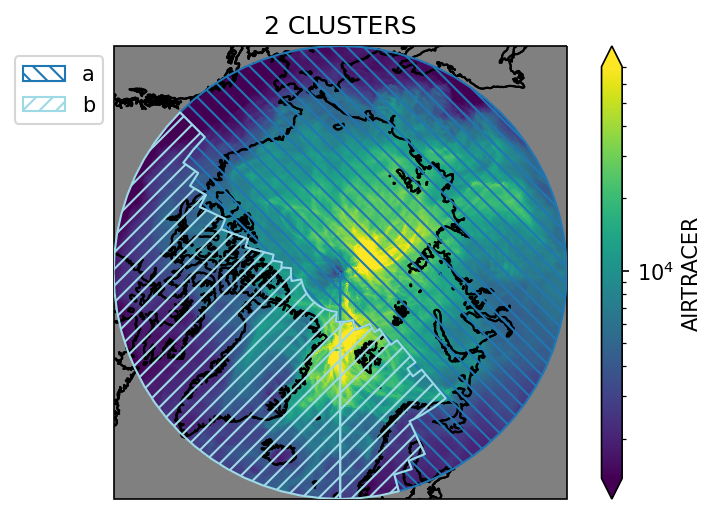
    


    

    


    
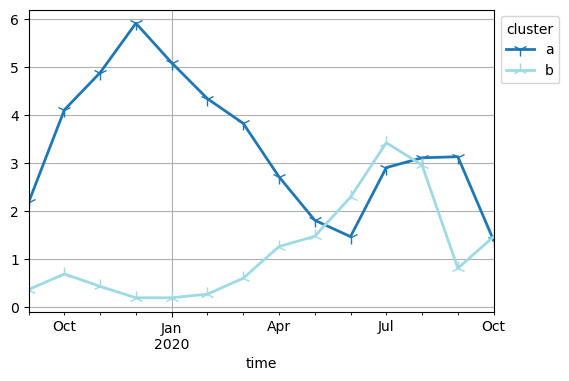
    


    

    


    
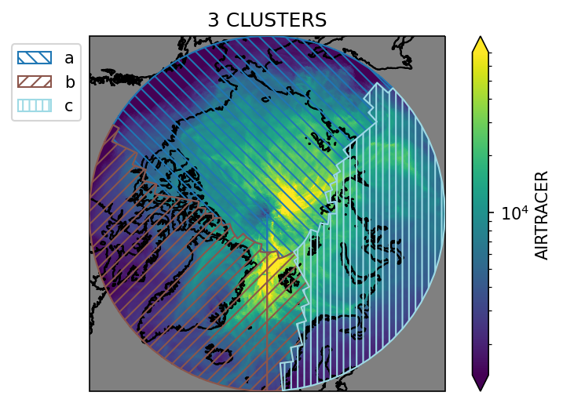
    


    
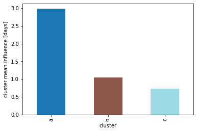
    


    
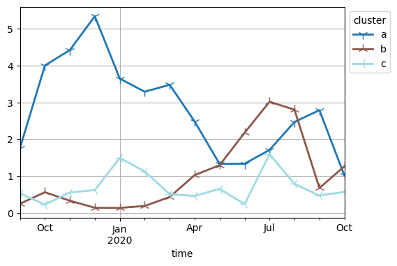
    


    
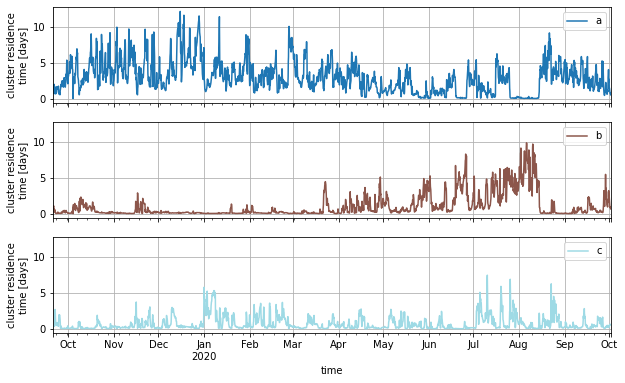
    


    
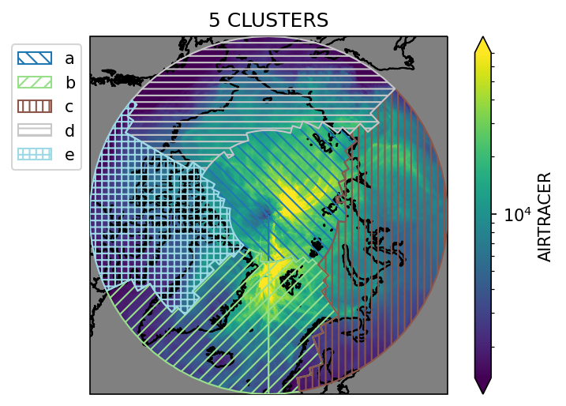
    


    
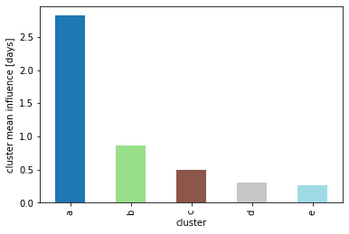
    


    
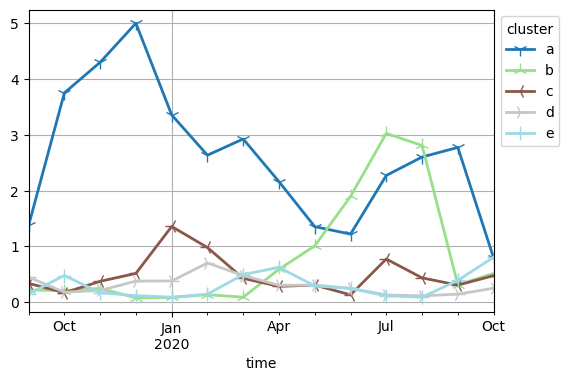
    


    
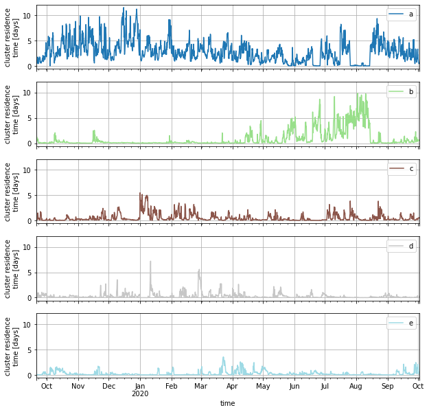
    


    
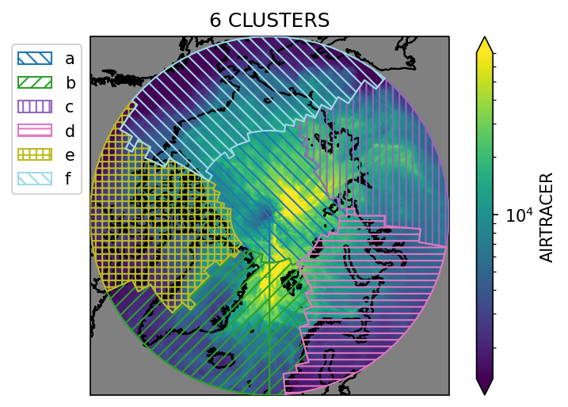
    


    
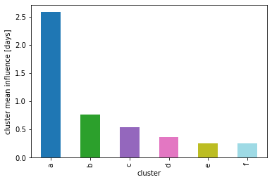
    


    
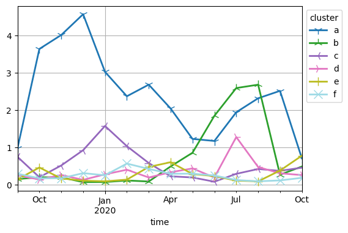
    


    
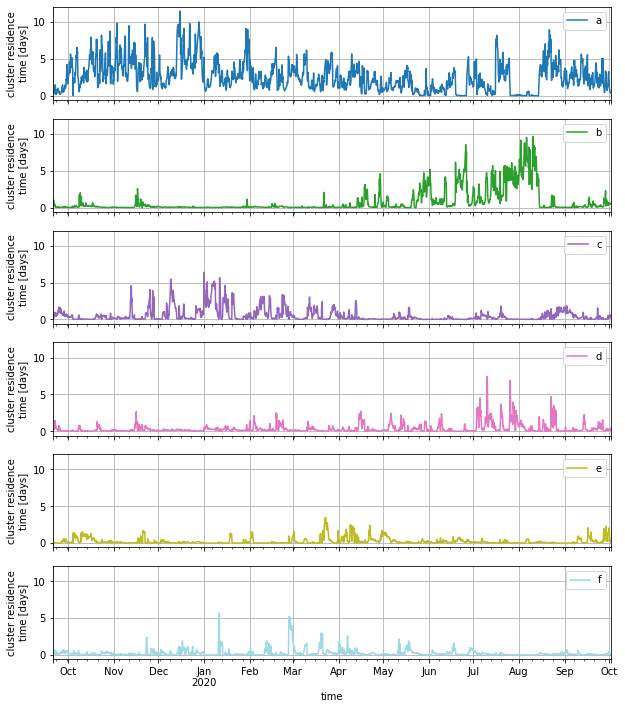
    


    
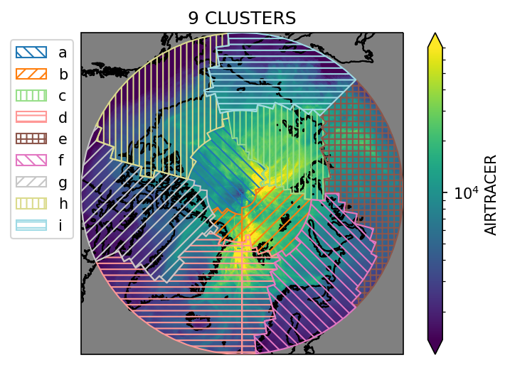
    


    
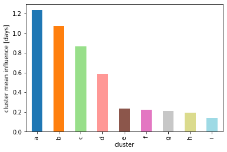
    


    
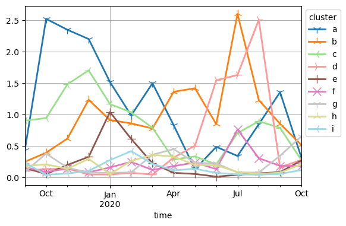
    


    
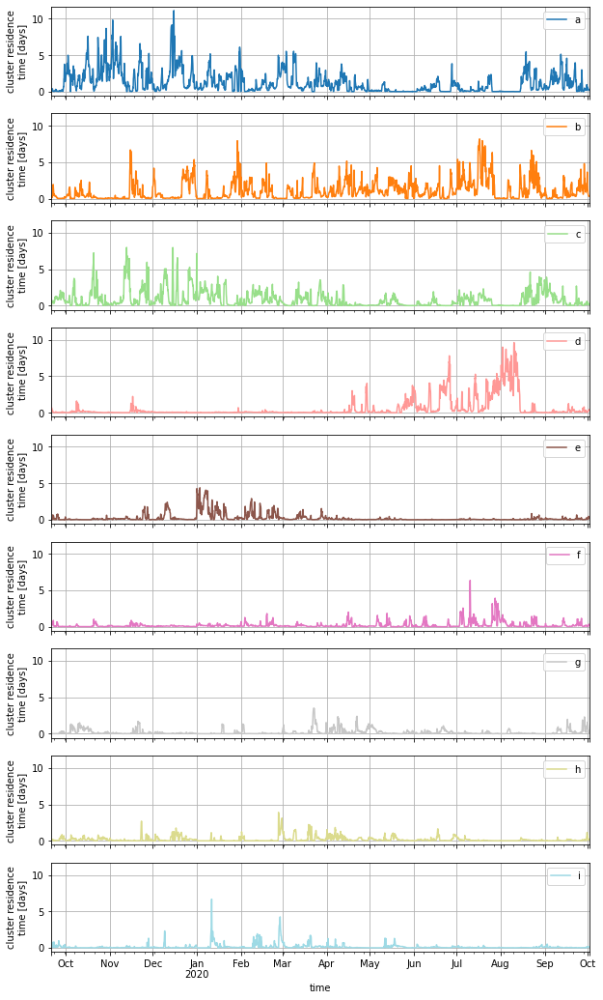
    


    
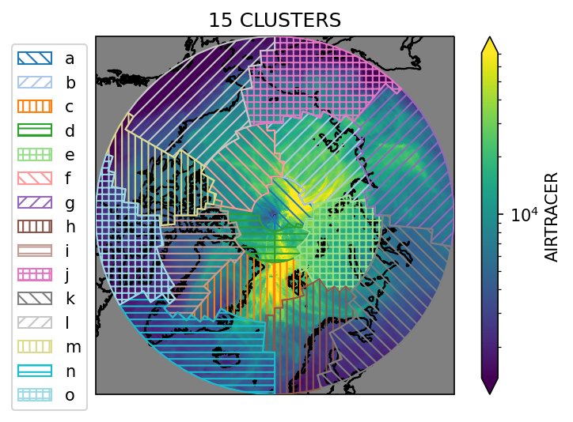
    


    
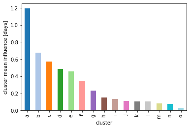
    


    
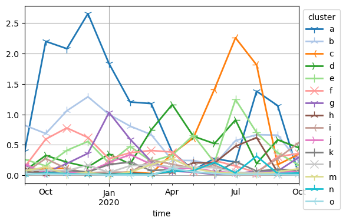
    


    
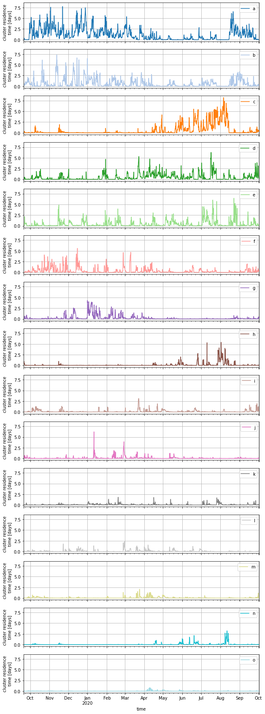
    


    
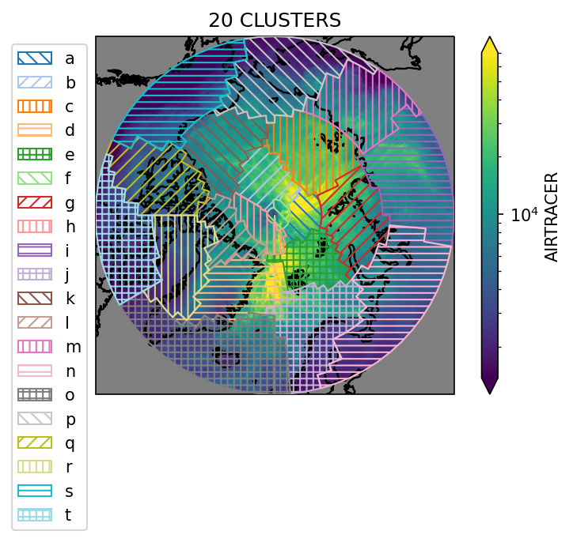
    


    
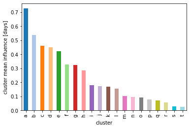
    


    
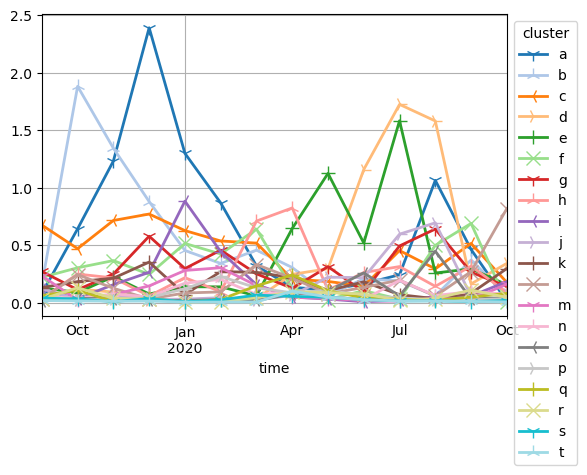
    


    
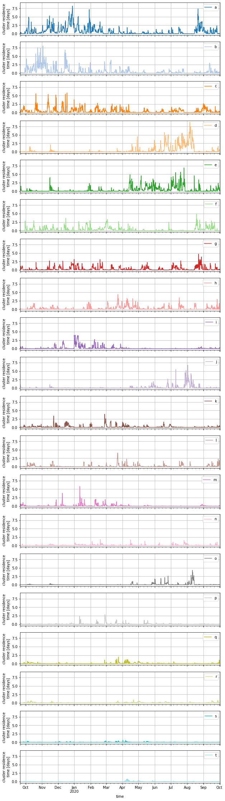
    


```python

```
