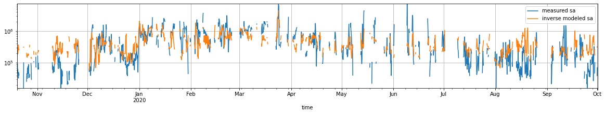
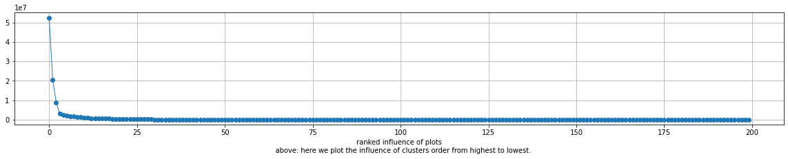

```python
%load_ext autoreload
%autoreload 2

import matplotlib.pyplot as plt
import numpy as np
import pandas as pd
import xarray as xr

import regression_funs as rfu
```


## constants and functions


```python

PATH_TO_FILE = '../data_in/flexpart-mosaic-data_alias/AIRTRACER_100m.nc'

PATH_TO_SO2 = '../data_in/flexpart-mosaic-data_alias/MSAQSO2L4_2005-2018_v01-04_20190314.h5'

PATH_TO_ST = '../data_in/ciapitof_masked_filtered.csv'

PATH_200_CLUS = '../data_out/cluster200.nc'

LA = 'lat'
LO = 'lon'
TI = 'time'
AG = 'age'
AT = 'AIRTRACER'
L = 'lab'
CM = 'tab20'

SA = 'sa'
MSA = 'msa'
IA = 'ia'

LSA = 'log10(sa)'
LMSA = 'log10(msa)'
LIA = 'log10(ia)'

COLS = [SA, MSA, IA]
LCOLS = [LSA, LMSA, LIA]

DATA_OUT = '../data_out'

COL = plt.get_cmap('Dark2')

DC = {
    SA  : COL(0),
    MSA : COL(1),
    IA  : COL(2),
    LSA : COL(0),
    LMSA: COL(1),
    LIA : COL(2),
}
```


```python
df = pd.read_csv(PATH_TO_ST, index_col=0, parse_dates=True)

for l, c in zip(COLS, LCOLS):
    df[c] = np.log10(df[l])
```

# distributions


lets find what kind of dist. do we have. They seem to be log dists.


```python
for c in COLS:
    df[c].plot.hist(color=DC[c])
```


    

    


```python
for c in COLS:
    np.log10(df[c]).plot.hist(alpha=.5, bins=100, label=c, color=DC[c])
ax = plt.gca()
ax.legend()
ax.set_xlabel('log10')
```


    Text(0.5, 0, 'log10')


    

    


# timeseries of the trace gases


```python

```

# open and merge flex 200 clusters


```python
ds = xr.open_dataset(PATH_200_CLUS)
```


```python

```


```python
dsf = ds.groupby(L).sum().to_dataframe()[AT].unstack(L)

q0, q1 = np.quantile(dsf.values.flatten(), [.01, .99])


# f, axs = plt.subplots(10, 20, sharex=True, sharey=True, figsize=(20, 20))
# axf = axs.flatten()

# for i, ax in zip(dsf.columns, axf):
#     ax.hist(np.log10(dsf[i] + q0), bins=np.linspace(np.log10(q0), np.log10(q1 + q0), 20))
#     ax.set_xlabel('')
#     ax.set_ylabel('')
```


```python
dsfn = dsf / dsf.mean()
```


```python
q0, q1 = dsfn.stack().quantile([.01, .99])
```


```python
# f, axs = plt.subplots(10, 20, sharex=True, sharey=True, figsize=(20, 20))
# axf = axs.flatten()

# for i, ax in zip(dsfn.columns, axf):
#     ax.hist(dsfn[i], bins=np.linspace(q0, q1, 20))
#     ax.set_xlabel('')
#     ax.set_ylabel('')
```


```python
df1 = df
```


```python
df2 = df1.resample('3H').median()
```


```python
dm = pd.merge(df2, dsf, left_index=True, right_index=True, how='inner', validate="1:1")
```


```python

```


```python

```

# Invers modeling elastic NET


```python
# for PAR in [SA,MSA,IA]:
for PAR in [SA]:
    pred, cdf, y, yn, dp = rfu.elastic_net_reg(dsf, dm, PAR)
    MEA = f'measured {PAR}'
    MOD = f'inverse modeled {PAR}'
    rfu.scatter_plot(y, yn, pred, MEA, MOD, PAR)
    rfu.mea_vs_mod_plot(y, yn, dp, pred, MEA, MOD)
    rfu.rank_cluster_inf(cdf)
    dd2 = rfu.get_plot_inf(cdf, L, ds,PAR)
    rfu.plot_map(dd2)
    rfu.plot_map_rect(dd2)
```


    

    


    

    


    

    


    

    


    

    


```python
cdf.sort_values(ascending=False)
```


    lab
    199    52654256.0
    196    20544958.0
    181     8979031.0
    132     3098593.5
    180     2535800.5
              ...    
    81            0.0
    82            0.0
    84            0.0
    85            0.0
    0             0.0
    Length: 200, dtype: float32


```python
import funs as fu
```


```python
d5 = fu.get_bounds(LA, ds[AT])
d6 = fu.get_bounds(LO, d5)

df = d6[L].to_dataframe()

df1 = df.loc[:, ~df.columns.duplicated()]

G = 'geometry'
```


```python
df1[G] = df.apply(fu.get_pol, axis=1)
```


```python
import geopandas
dg = geopandas.GeoDataFrame(df1).reset_index()

dg1 = dg[[L, G]].dissolve(by=L)
```


```python
cdf.name = 'infl'
```


```python
df2 = pd.merge(dg1,cdf,left_index=True,right_index=True)
```


```python
df3 = df2.sort_values('infl',ascending=False).iloc[:20]
```


```python
df3['infl']
```


    lab
    199    5.265426e+07
    196    2.054496e+07
    181    8.979031e+06
    132    3.098594e+06
    180    2.535800e+06
    168    1.881621e+06
    173    1.812176e+06
    159    1.730788e+06
    162    1.352591e+06
    86     1.257938e+06
    136    9.339772e+05
    105    8.134232e+05
    131    7.817694e+05
    42     7.806414e+05
    31     7.485286e+05
    100    6.634729e+05
    141    6.443596e+05
    109    5.435959e+05
    129    4.531878e+05
    14     3.943123e+05
    Name: infl, dtype: float32


```python
dm1 = dm[df3.index]
```


```python
dm2 = dm1/dm1.sum()
dm2 = (dm1 * df3['infl'])/100000
```


```python

```


```python
cmap = plt.get_cmap('tab20')
```


```python
co = dm2.columns
```


```python
q1,q2=dm2.stack().quantile([.001,.999])
```


```python

```


```python
lco = len(co)

f = plt.figure(constrained_layout=True,figsize=(2*7,lco*.6),dpi=200)

import matplotlib.gridspec as gridspec

gs = gridspec.GridSpec(lco,2)


# f,axs=plt.subplots(lco,dpi=200,sharex=True,sharey=True,figsize=(7,lco*.6))


ax0 = None
for i,c in enumerate(co):
    ax = f.add_subplot(gs[i, 1],sharex=ax0)
    if i == 0: ax0 = ax
    (dm2[c]).plot(c=cmap(i),ax=ax)
    ax.text(1,.5,f' {i}',transform=ax.transAxes,c=cmap(i))
    ax.grid()
    ax.set_ylim(0,q2*1.1)
# ax=plt.gca()
# ax.set_yscale('log')
# ax.set_ylim(q1,q2)
# ax.legend(bbox_to_anchor=(1,1))


import cartopy.crs as ccrs
ax = f.add_subplot(gs[:,0],projection=ccrs.Orthographic(0, 90), facecolor="gray")
rfu.plot_map(dd2,ax=ax)
# ax=plt.gca()
for i,c in enumerate(co):
    p =df3.centroid[c]
    ax.scatter( p.x,p.y,transform=ccrs.PlateCarree(),c='w',s=105,alpha=1,zorder=19)
    ax.text( p.x,p.y,i,transform=ccrs.PlateCarree(),c=cmap(i),va='center',ha='center',fontsize=7,zorder = 20)


```

    /Users/aliaga/miniforge3/envs/q5/lib/python3.9/site-packages/IPython/core/pylabtools.py:137: UserWarning: There are no gridspecs with layoutgrids. Possibly did not call parent GridSpec with the "figure" keyword
      fig.canvas.print_figure(bytes_io, **kw)


    

    


```python


```


```python
    from sklearn.linear_model import ElasticNetCV,ElasticNet

    c200 = dsf.columns

    X = dm[c200]

    xn = np.sqrt((X ** 2).sum())

    XX = X.divide(xn, axis=1)


    y = dm[PAR]
    yn = y.notna()
    y = y[yn]
    ii = [.1, .5, .7, .9, .95, .99, 1]
    regr = ElasticNetCV(cv=5, random_state=0, positive=True, l1_ratio=ii, fit_intercept=False)
#     regr = ElasticNet( random_state=0, positive=True, l1_ratio=ii, fit_intercept=False)

    regr.fit(XX[yn], y[yn])

    pred = regr.predict(XX[yn])
    dp = pd.Series(pred, index=y[yn].index)
    cdf = pd.Series(regr.coef_, index=XX.columns)
    cdf = cdf / xn
```


```python
regr = ElasticNetCV(alphas=.5,cv=5, random_state=0, positive=True, l1_ratio=ii, fit_intercept=False)
```


```python

```


```python
ccs = {}
r = {}
for a in np.geomspace(.1,8e3,201):
    from sklearn.linear_model import ElasticNetCV,ElasticNet

    c200 = dsf.columns

    X = dm[c200]

    xn = np.sqrt((X ** 2).sum())

    XX = X.divide(xn, axis=1)


    y = dm[PAR]
    yn = y.notna()
    y = y[yn]
    ii = [.1, .5, .7, .9, .95, .99, 1]
#     
    regr = ElasticNet(alpha=a, random_state=0, positive=True, l1_ratio=1, fit_intercept=False)

    regr.fit(XX[yn], y[yn])

    pred = regr.predict(XX[yn])
    dp = pd.Series(pred, index=y[yn].index)
    cdf = pd.Series(regr.coef_, index=XX.columns)
    cdf = cdf
    cdf = cdf/cdf.sum()
    ccs[a]=cdf
    r[a]=regr.score(XX[yn], y[yn])
```


```python
regr = ElasticNetCV(cv=5, random_state=0, positive=True, l1_ratio=ii, fit_intercept=False)
regr.fit(XX[yn], y[yn])
```


    ElasticNetCV(cv=5, fit_intercept=False,
                 l1_ratio=[0.1, 0.5, 0.7, 0.9, 0.95, 0.99, 1], positive=True,
                 random_state=0)


```python
regr.alpha_
```


    568.4891766138174


```python
pd.Series(r).plot()
```


    <AxesSubplot:>


    

    


```python
ddd = pd.DataFrame(ccs).T
```


```python

```


```python
ddd
```


<div>
<style scoped>
    .dataframe tbody tr th:only-of-type {
        vertical-align: middle;
    }

    .dataframe tbody tr th {
        vertical-align: top;
    }

    .dataframe thead th {
        text-align: right;
    }
</style>
<table border="1" class="dataframe">
  <thead>
    <tr style="text-align: right;">
      <th></th>
      <th>0</th>
      <th>1</th>
      <th>2</th>
      <th>3</th>
      <th>4</th>
      <th>5</th>
      <th>6</th>
      <th>7</th>
      <th>8</th>
      <th>9</th>
      <th>...</th>
      <th>190</th>
      <th>191</th>
      <th>192</th>
      <th>193</th>
      <th>194</th>
      <th>195</th>
      <th>196</th>
      <th>197</th>
      <th>198</th>
      <th>199</th>
    </tr>
  </thead>
  <tbody>
    <tr>
      <th>0.100000</th>
      <td>0.0</td>
      <td>0.0</td>
      <td>0.019391</td>
      <td>0.016957</td>
      <td>0.0</td>
      <td>0.0</td>
      <td>0.0</td>
      <td>0.0</td>
      <td>0.0</td>
      <td>0.0</td>
      <td>...</td>
      <td>0.0</td>
      <td>0.0</td>
      <td>0.0</td>
      <td>0.0</td>
      <td>0.0</td>
      <td>0.0</td>
      <td>0.071944</td>
      <td>0.0</td>
      <td>0.0</td>
      <td>0.016957</td>
    </tr>
    <tr>
      <th>0.105807</th>
      <td>0.0</td>
      <td>0.0</td>
      <td>0.019391</td>
      <td>0.016957</td>
      <td>0.0</td>
      <td>0.0</td>
      <td>0.0</td>
      <td>0.0</td>
      <td>0.0</td>
      <td>0.0</td>
      <td>...</td>
      <td>0.0</td>
      <td>0.0</td>
      <td>0.0</td>
      <td>0.0</td>
      <td>0.0</td>
      <td>0.0</td>
      <td>0.071944</td>
      <td>0.0</td>
      <td>0.0</td>
      <td>0.016957</td>
    </tr>
    <tr>
      <th>0.111952</th>
      <td>0.0</td>
      <td>0.0</td>
      <td>0.019391</td>
      <td>0.016957</td>
      <td>0.0</td>
      <td>0.0</td>
      <td>0.0</td>
      <td>0.0</td>
      <td>0.0</td>
      <td>0.0</td>
      <td>...</td>
      <td>0.0</td>
      <td>0.0</td>
      <td>0.0</td>
      <td>0.0</td>
      <td>0.0</td>
      <td>0.0</td>
      <td>0.071944</td>
      <td>0.0</td>
      <td>0.0</td>
      <td>0.016957</td>
    </tr>
    <tr>
      <th>0.118453</th>
      <td>0.0</td>
      <td>0.0</td>
      <td>0.019391</td>
      <td>0.016957</td>
      <td>0.0</td>
      <td>0.0</td>
      <td>0.0</td>
      <td>0.0</td>
      <td>0.0</td>
      <td>0.0</td>
      <td>...</td>
      <td>0.0</td>
      <td>0.0</td>
      <td>0.0</td>
      <td>0.0</td>
      <td>0.0</td>
      <td>0.0</td>
      <td>0.071944</td>
      <td>0.0</td>
      <td>0.0</td>
      <td>0.016957</td>
    </tr>
    <tr>
      <th>0.125332</th>
      <td>0.0</td>
      <td>0.0</td>
      <td>0.019391</td>
      <td>0.016957</td>
      <td>0.0</td>
      <td>0.0</td>
      <td>0.0</td>
      <td>0.0</td>
      <td>0.0</td>
      <td>0.0</td>
      <td>...</td>
      <td>0.0</td>
      <td>0.0</td>
      <td>0.0</td>
      <td>0.0</td>
      <td>0.0</td>
      <td>0.0</td>
      <td>0.071944</td>
      <td>0.0</td>
      <td>0.0</td>
      <td>0.016957</td>
    </tr>
    <tr>
      <th>...</th>
      <td>...</td>
      <td>...</td>
      <td>...</td>
      <td>...</td>
      <td>...</td>
      <td>...</td>
      <td>...</td>
      <td>...</td>
      <td>...</td>
      <td>...</td>
      <td>...</td>
      <td>...</td>
      <td>...</td>
      <td>...</td>
      <td>...</td>
      <td>...</td>
      <td>...</td>
      <td>...</td>
      <td>...</td>
      <td>...</td>
      <td>...</td>
    </tr>
    <tr>
      <th>6383.049131</th>
      <td>0.0</td>
      <td>0.0</td>
      <td>0.000000</td>
      <td>0.000000</td>
      <td>0.0</td>
      <td>0.0</td>
      <td>0.0</td>
      <td>0.0</td>
      <td>0.0</td>
      <td>0.0</td>
      <td>...</td>
      <td>0.0</td>
      <td>0.0</td>
      <td>0.0</td>
      <td>0.0</td>
      <td>0.0</td>
      <td>0.0</td>
      <td>0.308210</td>
      <td>0.0</td>
      <td>0.0</td>
      <td>0.000000</td>
    </tr>
    <tr>
      <th>6753.729109</th>
      <td>0.0</td>
      <td>0.0</td>
      <td>0.000000</td>
      <td>0.000000</td>
      <td>0.0</td>
      <td>0.0</td>
      <td>0.0</td>
      <td>0.0</td>
      <td>0.0</td>
      <td>0.0</td>
      <td>...</td>
      <td>0.0</td>
      <td>0.0</td>
      <td>0.0</td>
      <td>0.0</td>
      <td>0.0</td>
      <td>0.0</td>
      <td>0.259039</td>
      <td>0.0</td>
      <td>0.0</td>
      <td>0.000000</td>
    </tr>
    <tr>
      <th>7145.935421</th>
      <td>0.0</td>
      <td>0.0</td>
      <td>0.000000</td>
      <td>0.000000</td>
      <td>0.0</td>
      <td>0.0</td>
      <td>0.0</td>
      <td>0.0</td>
      <td>0.0</td>
      <td>0.0</td>
      <td>...</td>
      <td>0.0</td>
      <td>0.0</td>
      <td>0.0</td>
      <td>0.0</td>
      <td>0.0</td>
      <td>0.0</td>
      <td>0.175055</td>
      <td>0.0</td>
      <td>0.0</td>
      <td>0.000000</td>
    </tr>
    <tr>
      <th>7560.918157</th>
      <td>0.0</td>
      <td>0.0</td>
      <td>0.000000</td>
      <td>0.000000</td>
      <td>0.0</td>
      <td>0.0</td>
      <td>0.0</td>
      <td>0.0</td>
      <td>0.0</td>
      <td>0.0</td>
      <td>...</td>
      <td>0.0</td>
      <td>0.0</td>
      <td>0.0</td>
      <td>0.0</td>
      <td>0.0</td>
      <td>0.0</td>
      <td>0.000000</td>
      <td>0.0</td>
      <td>0.0</td>
      <td>0.000000</td>
    </tr>
    <tr>
      <th>8000.000000</th>
      <td>0.0</td>
      <td>0.0</td>
      <td>0.000000</td>
      <td>0.000000</td>
      <td>0.0</td>
      <td>0.0</td>
      <td>0.0</td>
      <td>0.0</td>
      <td>0.0</td>
      <td>0.0</td>
      <td>...</td>
      <td>0.0</td>
      <td>0.0</td>
      <td>0.0</td>
      <td>0.0</td>
      <td>0.0</td>
      <td>0.0</td>
      <td>0.000000</td>
      <td>0.0</td>
      <td>0.0</td>
      <td>0.000000</td>
    </tr>
  </tbody>
</table>
<p>201 rows × 200 columns</p>
</div>


```python
l = []
for a,r in ddd.iloc[::-1].iloc[::].iterrows():
    
    rr = r[~r.index.isin(l)]

    try:
        iii = rr.idxmax()
    #     print(iii)
        if rr.sum() == 0:
            continue
#             print(a)
        l.append(iii)
    except:
        break
    
    
```


```python
len(l)
```


    46


```python
ddd[l].plot.area()
ax = plt.gca()
ax.legend(bbox_to_anchor=(1,1))
# ax.legend().remove()
```


    <matplotlib.legend.Legend at 0x16bb33ca0>


    

    


```python
rem = set(ddd.columns)-set(l)
l1 = [*l,*rem]
```


```python
dd = pd.Series(l1).reset_index().set_index(0)['index'].to_dict()
```


```python
ds2 = ds[L].to_series().replace(dd).to_xarray()
```


```python
ds
```


<div><svg style="position: absolute; width: 0; height: 0; overflow: hidden">
<defs>
<symbol id="icon-database" viewBox="0 0 32 32">
<path d="M16 0c-8.837 0-16 2.239-16 5v4c0 2.761 7.163 5 16 5s16-2.239 16-5v-4c0-2.761-7.163-5-16-5z"></path>
<path d="M16 17c-8.837 0-16-2.239-16-5v6c0 2.761 7.163 5 16 5s16-2.239 16-5v-6c0 2.761-7.163 5-16 5z"></path>
<path d="M16 26c-8.837 0-16-2.239-16-5v6c0 2.761 7.163 5 16 5s16-2.239 16-5v-6c0 2.761-7.163 5-16 5z"></path>
</symbol>
<symbol id="icon-file-text2" viewBox="0 0 32 32">
<path d="M28.681 7.159c-0.694-0.947-1.662-2.053-2.724-3.116s-2.169-2.030-3.116-2.724c-1.612-1.182-2.393-1.319-2.841-1.319h-15.5c-1.378 0-2.5 1.121-2.5 2.5v27c0 1.378 1.122 2.5 2.5 2.5h23c1.378 0 2.5-1.122 2.5-2.5v-19.5c0-0.448-0.137-1.23-1.319-2.841zM24.543 5.457c0.959 0.959 1.712 1.825 2.268 2.543h-4.811v-4.811c0.718 0.556 1.584 1.309 2.543 2.268zM28 29.5c0 0.271-0.229 0.5-0.5 0.5h-23c-0.271 0-0.5-0.229-0.5-0.5v-27c0-0.271 0.229-0.5 0.5-0.5 0 0 15.499-0 15.5 0v7c0 0.552 0.448 1 1 1h7v19.5z"></path>
<path d="M23 26h-14c-0.552 0-1-0.448-1-1s0.448-1 1-1h14c0.552 0 1 0.448 1 1s-0.448 1-1 1z"></path>
<path d="M23 22h-14c-0.552 0-1-0.448-1-1s0.448-1 1-1h14c0.552 0 1 0.448 1 1s-0.448 1-1 1z"></path>
<path d="M23 18h-14c-0.552 0-1-0.448-1-1s0.448-1 1-1h14c0.552 0 1 0.448 1 1s-0.448 1-1 1z"></path>
</symbol>
</defs>
</svg>
<style>/* CSS stylesheet for displaying xarray objects in jupyterlab.
 *
 */

:root {
  --xr-font-color0: var(--jp-content-font-color0, rgba(0, 0, 0, 1));
  --xr-font-color2: var(--jp-content-font-color2, rgba(0, 0, 0, 0.54));
  --xr-font-color3: var(--jp-content-font-color3, rgba(0, 0, 0, 0.38));
  --xr-border-color: var(--jp-border-color2, #e0e0e0);
  --xr-disabled-color: var(--jp-layout-color3, #bdbdbd);
  --xr-background-color: var(--jp-layout-color0, white);
  --xr-background-color-row-even: var(--jp-layout-color1, white);
  --xr-background-color-row-odd: var(--jp-layout-color2, #eeeeee);
}

html[theme=dark],
body.vscode-dark {
  --xr-font-color0: rgba(255, 255, 255, 1);
  --xr-font-color2: rgba(255, 255, 255, 0.54);
  --xr-font-color3: rgba(255, 255, 255, 0.38);
  --xr-border-color: #1F1F1F;
  --xr-disabled-color: #515151;
  --xr-background-color: #111111;
  --xr-background-color-row-even: #111111;
  --xr-background-color-row-odd: #313131;
}

.xr-wrap {
  display: block;
  min-width: 300px;
  max-width: 700px;
}

.xr-text-repr-fallback {
  /* fallback to plain text repr when CSS is not injected (untrusted notebook) */
  display: none;
}

.xr-header {
  padding-top: 6px;
  padding-bottom: 6px;
  margin-bottom: 4px;
  border-bottom: solid 1px var(--xr-border-color);
}

.xr-header > div,
.xr-header > ul {
  display: inline;
  margin-top: 0;
  margin-bottom: 0;
}

.xr-obj-type,
.xr-array-name {
  margin-left: 2px;
  margin-right: 10px;
}

.xr-obj-type {
  color: var(--xr-font-color2);
}

.xr-sections {
  padding-left: 0 !important;
  display: grid;
  grid-template-columns: 150px auto auto 1fr 20px 20px;
}

.xr-section-item {
  display: contents;
}

.xr-section-item input {
  display: none;
}

.xr-section-item input + label {
  color: var(--xr-disabled-color);
}

.xr-section-item input:enabled + label {
  cursor: pointer;
  color: var(--xr-font-color2);
}

.xr-section-item input:enabled + label:hover {
  color: var(--xr-font-color0);
}

.xr-section-summary {
  grid-column: 1;
  color: var(--xr-font-color2);
  font-weight: 500;
}

.xr-section-summary > span {
  display: inline-block;
  padding-left: 0.5em;
}

.xr-section-summary-in:disabled + label {
  color: var(--xr-font-color2);
}

.xr-section-summary-in + label:before {
  display: inline-block;
  content: '►';
  font-size: 11px;
  width: 15px;
  text-align: center;
}

.xr-section-summary-in:disabled + label:before {
  color: var(--xr-disabled-color);
}

.xr-section-summary-in:checked + label:before {
  content: '▼';
}

.xr-section-summary-in:checked + label > span {
  display: none;
}

.xr-section-summary,
.xr-section-inline-details {
  padding-top: 4px;
  padding-bottom: 4px;
}

.xr-section-inline-details {
  grid-column: 2 / -1;
}

.xr-section-details {
  display: none;
  grid-column: 1 / -1;
  margin-bottom: 5px;
}

.xr-section-summary-in:checked ~ .xr-section-details {
  display: contents;
}

.xr-array-wrap {
  grid-column: 1 / -1;
  display: grid;
  grid-template-columns: 20px auto;
}

.xr-array-wrap > label {
  grid-column: 1;
  vertical-align: top;
}

.xr-preview {
  color: var(--xr-font-color3);
}

.xr-array-preview,
.xr-array-data {
  padding: 0 5px !important;
  grid-column: 2;
}

.xr-array-data,
.xr-array-in:checked ~ .xr-array-preview {
  display: none;
}

.xr-array-in:checked ~ .xr-array-data,
.xr-array-preview {
  display: inline-block;
}

.xr-dim-list {
  display: inline-block !important;
  list-style: none;
  padding: 0 !important;
  margin: 0;
}

.xr-dim-list li {
  display: inline-block;
  padding: 0;
  margin: 0;
}

.xr-dim-list:before {
  content: '(';
}

.xr-dim-list:after {
  content: ')';
}

.xr-dim-list li:not(:last-child):after {
  content: ',';
  padding-right: 5px;
}

.xr-has-index {
  font-weight: bold;
}

.xr-var-list,
.xr-var-item {
  display: contents;
}

.xr-var-item > div,
.xr-var-item label,
.xr-var-item > .xr-var-name span {
  background-color: var(--xr-background-color-row-even);
  margin-bottom: 0;
}

.xr-var-item > .xr-var-name:hover span {
  padding-right: 5px;
}

.xr-var-list > li:nth-child(odd) > div,
.xr-var-list > li:nth-child(odd) > label,
.xr-var-list > li:nth-child(odd) > .xr-var-name span {
  background-color: var(--xr-background-color-row-odd);
}

.xr-var-name {
  grid-column: 1;
}

.xr-var-dims {
  grid-column: 2;
}

.xr-var-dtype {
  grid-column: 3;
  text-align: right;
  color: var(--xr-font-color2);
}

.xr-var-preview {
  grid-column: 4;
}

.xr-var-name,
.xr-var-dims,
.xr-var-dtype,
.xr-preview,
.xr-attrs dt {
  white-space: nowrap;
  overflow: hidden;
  text-overflow: ellipsis;
  padding-right: 10px;
}

.xr-var-name:hover,
.xr-var-dims:hover,
.xr-var-dtype:hover,
.xr-attrs dt:hover {
  overflow: visible;
  width: auto;
  z-index: 1;
}

.xr-var-attrs,
.xr-var-data {
  display: none;
  background-color: var(--xr-background-color) !important;
  padding-bottom: 5px !important;
}

.xr-var-attrs-in:checked ~ .xr-var-attrs,
.xr-var-data-in:checked ~ .xr-var-data {
  display: block;
}

.xr-var-data > table {
  float: right;
}

.xr-var-name span,
.xr-var-data,
.xr-attrs {
  padding-left: 25px !important;
}

.xr-attrs,
.xr-var-attrs,
.xr-var-data {
  grid-column: 1 / -1;
}

dl.xr-attrs {
  padding: 0;
  margin: 0;
  display: grid;
  grid-template-columns: 125px auto;
}

.xr-attrs dt,
.xr-attrs dd {
  padding: 0;
  margin: 0;
  float: left;
  padding-right: 10px;
  width: auto;
}

.xr-attrs dt {
  font-weight: normal;
  grid-column: 1;
}

.xr-attrs dt:hover span {
  display: inline-block;
  background: var(--xr-background-color);
  padding-right: 10px;
}

.xr-attrs dd {
  grid-column: 2;
  white-space: pre-wrap;
  word-break: break-all;
}

.xr-icon-database,
.xr-icon-file-text2 {
  display: inline-block;
  vertical-align: middle;
  width: 1em;
  height: 1.5em !important;
  stroke-width: 0;
  stroke: currentColor;
  fill: currentColor;
}
</style><pre class='xr-text-repr-fallback'>&lt;xarray.Dataset&gt;
Dimensions:    (lon: 72, lat: 24, time: 3021)
Coordinates:
  * lon        (lon) float64 2.5 7.5 12.5 17.5 22.5 ... 342.5 347.5 352.5 357.5
  * lat        (lat) float64 60.62 61.88 63.12 64.38 ... 85.62 86.88 88.12 89.38
  * time       (time) datetime64[ns] 2019-09-20T09:00:00 ... 2020-10-01T21:00:00
    lab        (lat, lon) int64 162 193 193 173 173 173 ... 123 123 123 123 144
Data variables:
    AIRTRACER  (time, lat, lon) float32 0.0004269 0.0001852 ... 0.0002132</pre><div class='xr-wrap' hidden><div class='xr-header'><div class='xr-obj-type'>xarray.Dataset</div></div><ul class='xr-sections'><li class='xr-section-item'><input id='section-08001e40-a133-467d-ad98-c7704f0e065f' class='xr-section-summary-in' type='checkbox' disabled ><label for='section-08001e40-a133-467d-ad98-c7704f0e065f' class='xr-section-summary'  title='Expand/collapse section'>Dimensions:</label><div class='xr-section-inline-details'><ul class='xr-dim-list'><li><span class='xr-has-index'>lon</span>: 72</li><li><span class='xr-has-index'>lat</span>: 24</li><li><span class='xr-has-index'>time</span>: 3021</li></ul></div><div class='xr-section-details'></div></li><li class='xr-section-item'><input id='section-acf861b6-697b-4e3c-9e5e-668e37ef1af8' class='xr-section-summary-in' type='checkbox'  checked><label for='section-acf861b6-697b-4e3c-9e5e-668e37ef1af8' class='xr-section-summary' >Coordinates: <span>(4)</span></label><div class='xr-section-inline-details'></div><div class='xr-section-details'><ul class='xr-var-list'><li class='xr-var-item'><div class='xr-var-name'><span class='xr-has-index'>lon</span></div><div class='xr-var-dims'>(lon)</div><div class='xr-var-dtype'>float64</div><div class='xr-var-preview xr-preview'>2.5 7.5 12.5 ... 347.5 352.5 357.5</div><input id='attrs-663ddded-6bd7-4af2-b7f8-b941aebe6478' class='xr-var-attrs-in' type='checkbox' disabled><label for='attrs-663ddded-6bd7-4af2-b7f8-b941aebe6478' title='Show/Hide attributes'><svg class='icon xr-icon-file-text2'><use xlink:href='#icon-file-text2'></use></svg></label><input id='data-0d85163c-383d-426d-91d2-c790429b0423' class='xr-var-data-in' type='checkbox'><label for='data-0d85163c-383d-426d-91d2-c790429b0423' title='Show/Hide data repr'><svg class='icon xr-icon-database'><use xlink:href='#icon-database'></use></svg></label><div class='xr-var-attrs'><dl class='xr-attrs'></dl></div><div class='xr-var-data'><pre>array([  2.5,   7.5,  12.5,  17.5,  22.5,  27.5,  32.5,  37.5,  42.5,  47.5,
        52.5,  57.5,  62.5,  67.5,  72.5,  77.5,  82.5,  87.5,  92.5,  97.5,
       102.5, 107.5, 112.5, 117.5, 122.5, 127.5, 132.5, 137.5, 142.5, 147.5,
       152.5, 157.5, 162.5, 167.5, 172.5, 177.5, 182.5, 187.5, 192.5, 197.5,
       202.5, 207.5, 212.5, 217.5, 222.5, 227.5, 232.5, 237.5, 242.5, 247.5,
       252.5, 257.5, 262.5, 267.5, 272.5, 277.5, 282.5, 287.5, 292.5, 297.5,
       302.5, 307.5, 312.5, 317.5, 322.5, 327.5, 332.5, 337.5, 342.5, 347.5,
       352.5, 357.5])</pre></div></li><li class='xr-var-item'><div class='xr-var-name'><span class='xr-has-index'>lat</span></div><div class='xr-var-dims'>(lat)</div><div class='xr-var-dtype'>float64</div><div class='xr-var-preview xr-preview'>60.62 61.88 63.12 ... 88.12 89.38</div><input id='attrs-3023c808-d660-4753-9140-5d7dd83fbdd5' class='xr-var-attrs-in' type='checkbox' disabled><label for='attrs-3023c808-d660-4753-9140-5d7dd83fbdd5' title='Show/Hide attributes'><svg class='icon xr-icon-file-text2'><use xlink:href='#icon-file-text2'></use></svg></label><input id='data-acdd8eef-cbaa-4908-b15d-93b2c244cea0' class='xr-var-data-in' type='checkbox'><label for='data-acdd8eef-cbaa-4908-b15d-93b2c244cea0' title='Show/Hide data repr'><svg class='icon xr-icon-database'><use xlink:href='#icon-database'></use></svg></label><div class='xr-var-attrs'><dl class='xr-attrs'></dl></div><div class='xr-var-data'><pre>array([60.625, 61.875, 63.125, 64.375, 65.625, 66.875, 68.125, 69.375, 70.625,
       71.875, 73.125, 74.375, 75.625, 76.875, 78.125, 79.375, 80.625, 81.875,
       83.125, 84.375, 85.625, 86.875, 88.125, 89.375])</pre></div></li><li class='xr-var-item'><div class='xr-var-name'><span class='xr-has-index'>time</span></div><div class='xr-var-dims'>(time)</div><div class='xr-var-dtype'>datetime64[ns]</div><div class='xr-var-preview xr-preview'>2019-09-20T09:00:00 ... 2020-10-...</div><input id='attrs-887a1db4-49c6-48f5-b1b0-08998e020c17' class='xr-var-attrs-in' type='checkbox' ><label for='attrs-887a1db4-49c6-48f5-b1b0-08998e020c17' title='Show/Hide attributes'><svg class='icon xr-icon-file-text2'><use xlink:href='#icon-file-text2'></use></svg></label><input id='data-12662adc-914d-41c3-8dca-11289deec743' class='xr-var-data-in' type='checkbox'><label for='data-12662adc-914d-41c3-8dca-11289deec743' title='Show/Hide data repr'><svg class='icon xr-icon-database'><use xlink:href='#icon-database'></use></svg></label><div class='xr-var-attrs'><dl class='xr-attrs'><dt><span>long_name :</span></dt><dd>hours since 2019-09-20 09:00</dd></dl></div><div class='xr-var-data'><pre>array([&#x27;2019-09-20T09:00:00.000000000&#x27;, &#x27;2019-09-20T12:00:00.000000000&#x27;,
       &#x27;2019-09-20T15:00:00.000000000&#x27;, ..., &#x27;2020-10-01T15:00:00.000000000&#x27;,
       &#x27;2020-10-01T18:00:00.000000000&#x27;, &#x27;2020-10-01T21:00:00.000000000&#x27;],
      dtype=&#x27;datetime64[ns]&#x27;)</pre></div></li><li class='xr-var-item'><div class='xr-var-name'><span>lab</span></div><div class='xr-var-dims'>(lat, lon)</div><div class='xr-var-dtype'>int64</div><div class='xr-var-preview xr-preview'>162 193 193 173 ... 123 123 123 144</div><input id='attrs-13142669-a3f0-4a85-8d3f-02830509b246' class='xr-var-attrs-in' type='checkbox' disabled><label for='attrs-13142669-a3f0-4a85-8d3f-02830509b246' title='Show/Hide attributes'><svg class='icon xr-icon-file-text2'><use xlink:href='#icon-file-text2'></use></svg></label><input id='data-19b058dd-ce66-4438-8dff-7d1806777ca9' class='xr-var-data-in' type='checkbox'><label for='data-19b058dd-ce66-4438-8dff-7d1806777ca9' title='Show/Hide data repr'><svg class='icon xr-icon-database'><use xlink:href='#icon-database'></use></svg></label><div class='xr-var-attrs'><dl class='xr-attrs'></dl></div><div class='xr-var-data'><pre>array([[162, 193, 193, ..., 152, 162, 162],
       [162, 193, 193, ..., 152, 162, 162],
       [162, 193, 193, ..., 148, 148, 162],
       ...,
       [ 13,  13,  13, ..., 102, 102, 102],
       [ 81,  81,  81, ...,  81,  81,  81],
       [144, 144, 144, ..., 123, 123, 144]])</pre></div></li></ul></div></li><li class='xr-section-item'><input id='section-0ebc120e-8b3a-4957-a1a3-985497eba0e2' class='xr-section-summary-in' type='checkbox'  checked><label for='section-0ebc120e-8b3a-4957-a1a3-985497eba0e2' class='xr-section-summary' >Data variables: <span>(1)</span></label><div class='xr-section-inline-details'></div><div class='xr-section-details'><ul class='xr-var-list'><li class='xr-var-item'><div class='xr-var-name'><span>AIRTRACER</span></div><div class='xr-var-dims'>(time, lat, lon)</div><div class='xr-var-dtype'>float32</div><div class='xr-var-preview xr-preview'>0.0004269 0.0001852 ... 0.0002132</div><input id='attrs-9e13bf18-4403-4099-a658-71a740dcaf7a' class='xr-var-attrs-in' type='checkbox' disabled><label for='attrs-9e13bf18-4403-4099-a658-71a740dcaf7a' title='Show/Hide attributes'><svg class='icon xr-icon-file-text2'><use xlink:href='#icon-file-text2'></use></svg></label><input id='data-eee49d7f-86c4-427f-be12-9e2658ef0927' class='xr-var-data-in' type='checkbox'><label for='data-eee49d7f-86c4-427f-be12-9e2658ef0927' title='Show/Hide data repr'><svg class='icon xr-icon-database'><use xlink:href='#icon-database'></use></svg></label><div class='xr-var-attrs'><dl class='xr-attrs'></dl></div><div class='xr-var-data'><pre>array([[[4.268563e-04, 1.852375e-04, ..., 2.621723e-04, 2.943228e-04],
        [4.052322e-04, 1.807687e-04, ..., 2.240264e-04, 2.522779e-04],
        ...,
        [1.307839e-02, 1.780873e-02, ..., 5.970140e-04, 5.370654e-03],
        [1.349513e-02, 1.612342e-02, ..., 6.169785e-03, 1.135256e-02]],

       [[3.539727e-04, 1.817460e-04, ..., 1.960023e-04, 2.683101e-04],
        [3.486043e-04, 1.922844e-04, ..., 1.700503e-04, 2.743898e-04],
        ...,
        [1.824136e-02, 2.463412e-02, ..., 5.580768e-03, 1.393889e-02],
        [1.741647e-02, 1.864909e-02, ..., 1.828488e-02, 1.803528e-02]],

       ...,

       [[3.538048e-04, 3.289605e-04, ..., 3.454678e-04, 2.917684e-04],
        [3.458934e-04, 2.699237e-04, ..., 4.989626e-04, 3.907704e-04],
        ...,
        [3.555111e-05, 4.241330e-05, ..., 3.796500e-05, 3.836580e-05],
        [1.048749e-05, 1.185114e-05, ..., 1.207331e-05, 9.389475e-06]],

       [[6.397812e-04, 6.086012e-04, ..., 4.928912e-04, 4.372060e-04],
        [6.053369e-04, 4.210267e-04, ..., 6.160549e-04, 5.517354e-04],
        ...,
        [1.858562e-04, 8.900857e-05, ..., 3.811657e-04, 2.670756e-04],
        [1.806014e-04, 1.131911e-04, ..., 2.551314e-04, 2.132116e-04]]],
      dtype=float32)</pre></div></li></ul></div></li><li class='xr-section-item'><input id='section-57376c91-43b9-4d00-a1b1-4a447170ec64' class='xr-section-summary-in' type='checkbox' disabled ><label for='section-57376c91-43b9-4d00-a1b1-4a447170ec64' class='xr-section-summary'  title='Expand/collapse section'>Attributes: <span>(0)</span></label><div class='xr-section-inline-details'></div><div class='xr-section-details'><dl class='xr-attrs'></dl></div></li></ul></div></div>


```python
q1,q2 = ds[AT].sum('time').quantile([.01,.5])
```


```python
import matplotlib as mpl
dic = dict(projection=ccrs.Orthographic(0, 90), facecolor=".8")


f, axs = plt.subplots(6,6,subplot_kw=dic, sharex=True,sharey=True,figsize=(15,15),dpi=150)
for i in range(36):
    ax = axs.flatten()[i]
    p=ds[AT].sum('time').where(ds2<i).plot(
        # subplot_kws=dic,
        transform=ccrs.PlateCarree(),
    #     norm=mpl.colors.LogNorm(vmin, vmax),
    #     robust=True,
        cmap='viridis',
        vmax=q2,
        vmin=0,
        ax=ax
        
    )
    ax.set_title(i+1)
    if i ==15:    
        for spine in ax.spines.values():
            spine.set_edgecolor('red')
            spine.set_linewidth(5)
    p.axes.coastlines(lw=.5)


```


    

    


```python
ds16 = ds[AT].sum('time').where(ds2<i)
```


```python
ds16.to_dataframe()
```


<div>
<style scoped>
    .dataframe tbody tr th:only-of-type {
        vertical-align: middle;
    }

    .dataframe tbody tr th {
        vertical-align: top;
    }

    .dataframe thead th {
        text-align: right;
    }
</style>
<table border="1" class="dataframe">
  <thead>
    <tr style="text-align: right;">
      <th></th>
      <th></th>
      <th>lab</th>
      <th>AIRTRACER</th>
    </tr>
    <tr>
      <th>lat</th>
      <th>lon</th>
      <th></th>
      <th></th>
    </tr>
  </thead>
  <tbody>
    <tr>
      <th rowspan="5" valign="top">60.625</th>
      <th>2.5</th>
      <td>162</td>
      <td>NaN</td>
    </tr>
    <tr>
      <th>7.5</th>
      <td>193</td>
      <td>NaN</td>
    </tr>
    <tr>
      <th>12.5</th>
      <td>193</td>
      <td>NaN</td>
    </tr>
    <tr>
      <th>17.5</th>
      <td>173</td>
      <td>1.107274</td>
    </tr>
    <tr>
      <th>22.5</th>
      <td>173</td>
      <td>1.101493</td>
    </tr>
    <tr>
      <th>...</th>
      <th>...</th>
      <td>...</td>
      <td>...</td>
    </tr>
    <tr>
      <th rowspan="5" valign="top">89.375</th>
      <th>337.5</th>
      <td>123</td>
      <td>NaN</td>
    </tr>
    <tr>
      <th>342.5</th>
      <td>123</td>
      <td>NaN</td>
    </tr>
    <tr>
      <th>347.5</th>
      <td>123</td>
      <td>NaN</td>
    </tr>
    <tr>
      <th>352.5</th>
      <td>123</td>
      <td>NaN</td>
    </tr>
    <tr>
      <th>357.5</th>
      <td>144</td>
      <td>NaN</td>
    </tr>
  </tbody>
</table>
<p>1728 rows × 2 columns</p>
</div>


```python

```


```python

```


```python
import geopandas

d5 = fu.get_bounds(LA, ds[AT])
d6 = fu.get_bounds(LO, d5)

df = d6[L].to_dataframe()

df1 = df.loc[:, ~df.columns.duplicated()]

G = 'geometry'

df1[G] = df.apply(fu.get_pol, axis=1)


dg = geopandas.GeoDataFrame(df1).reset_index()

dg1 = dg[[L, G]].dissolve(by=L)
```


```python
dg2=dg1[dg1.index.isin(l[:16])]
dg2.plot()
```


    <AxesSubplot:>


    

    


```python
mpol = dg2.unary_union
```


```python
pols = list(mpol)
```


```python
pols_se = geopandas.GeoDataFrame(geometry=pols)
```


```python
pols_se = pols_se[:]
```


```python
pols_se['area'] = pols_se.area
```


```python
ps1 = pols_se.sort_values('area')[::-1].reset_index(drop=True)
```


```python
from shapely import geometry
ps1.contains(geometry.Point([.1,.1]))
```


    0    False
    1    False
    2    False
    3    False
    4    False
    5    False
    6    False
    7    False
    8    False
    dtype: bool


```python
df= ds.to_dataframe()
```


```python
iv = {}
for i,v in dg2.centroid.items():
    n = ps1[ps1.contains(v)].index[0]
    iv[i]=n
```


```python
iv
```


    {14: 6,
     31: 7,
     40: 0,
     42: 5,
     67: 1,
     86: 0,
     105: 0,
     109: 1,
     131: 0,
     141: 0,
     173: 2,
     180: 1,
     181: 3,
     196: 8,
     197: 4,
     199: 4}


```python
dss =ds.to_dataframe()
```


```python
dss
```


<div>
<style scoped>
    .dataframe tbody tr th:only-of-type {
        vertical-align: middle;
    }

    .dataframe tbody tr th {
        vertical-align: top;
    }

    .dataframe thead th {
        text-align: right;
    }
</style>
<table border="1" class="dataframe">
  <thead>
    <tr style="text-align: right;">
      <th></th>
      <th></th>
      <th></th>
      <th>lab</th>
      <th>AIRTRACER</th>
    </tr>
    <tr>
      <th>lon</th>
      <th>lat</th>
      <th>time</th>
      <th></th>
      <th></th>
    </tr>
  </thead>
  <tbody>
    <tr>
      <th rowspan="5" valign="top">2.5</th>
      <th rowspan="5" valign="top">60.625</th>
      <th>2019-09-20 09:00:00</th>
      <td>162</td>
      <td>0.000427</td>
    </tr>
    <tr>
      <th>2019-09-20 12:00:00</th>
      <td>162</td>
      <td>0.000354</td>
    </tr>
    <tr>
      <th>2019-09-20 15:00:00</th>
      <td>162</td>
      <td>0.000287</td>
    </tr>
    <tr>
      <th>2019-09-20 18:00:00</th>
      <td>162</td>
      <td>0.000290</td>
    </tr>
    <tr>
      <th>2019-09-20 21:00:00</th>
      <td>162</td>
      <td>0.000438</td>
    </tr>
    <tr>
      <th>...</th>
      <th>...</th>
      <th>...</th>
      <td>...</td>
      <td>...</td>
    </tr>
    <tr>
      <th rowspan="5" valign="top">357.5</th>
      <th rowspan="5" valign="top">89.375</th>
      <th>2020-10-01 09:00:00</th>
      <td>144</td>
      <td>0.000007</td>
    </tr>
    <tr>
      <th>2020-10-01 12:00:00</th>
      <td>144</td>
      <td>0.000006</td>
    </tr>
    <tr>
      <th>2020-10-01 15:00:00</th>
      <td>144</td>
      <td>0.000010</td>
    </tr>
    <tr>
      <th>2020-10-01 18:00:00</th>
      <td>144</td>
      <td>0.000009</td>
    </tr>
    <tr>
      <th>2020-10-01 21:00:00</th>
      <td>144</td>
      <td>0.000213</td>
    </tr>
  </tbody>
</table>
<p>5220288 rows × 2 columns</p>
</div>


```python
dss1 = dss[dss[L].isin(l[:16])].copy()
```


```python

NL = 'nl'
```


```python
dss1[NL] = dss1[L].replace(iv)
```


```python
dss2 = dss1.where(dss1[NL]<9)
```


```python
ndf = dss2.reset_index().groupby([NL,'time'])[AT].sum().unstack().T
```


```python
ndf
```


<div>
<style scoped>
    .dataframe tbody tr th:only-of-type {
        vertical-align: middle;
    }

    .dataframe tbody tr th {
        vertical-align: top;
    }

    .dataframe thead th {
        text-align: right;
    }
</style>
<table border="1" class="dataframe">
  <thead>
    <tr style="text-align: right;">
      <th>nl</th>
      <th>0</th>
      <th>1</th>
      <th>2</th>
      <th>3</th>
      <th>4</th>
      <th>5</th>
      <th>6</th>
      <th>7</th>
      <th>8</th>
    </tr>
    <tr>
      <th>time</th>
      <th></th>
      <th></th>
      <th></th>
      <th></th>
      <th></th>
      <th></th>
      <th></th>
      <th></th>
      <th></th>
    </tr>
  </thead>
  <tbody>
    <tr>
      <th>2019-09-20 09:00:00</th>
      <td>0.011834</td>
      <td>0.024645</td>
      <td>0.001831</td>
      <td>0.008871</td>
      <td>0.003009</td>
      <td>0.073558</td>
      <td>0.000145</td>
      <td>0.000063</td>
      <td>0.000231</td>
    </tr>
    <tr>
      <th>2019-09-20 12:00:00</th>
      <td>0.012736</td>
      <td>0.024684</td>
      <td>0.001938</td>
      <td>0.012416</td>
      <td>0.003316</td>
      <td>0.028905</td>
      <td>0.000179</td>
      <td>0.000036</td>
      <td>0.000300</td>
    </tr>
    <tr>
      <th>2019-09-20 15:00:00</th>
      <td>0.012373</td>
      <td>0.023693</td>
      <td>0.001589</td>
      <td>0.017557</td>
      <td>0.003991</td>
      <td>0.017514</td>
      <td>0.000382</td>
      <td>0.000040</td>
      <td>0.000306</td>
    </tr>
    <tr>
      <th>2019-09-20 18:00:00</th>
      <td>0.011654</td>
      <td>0.022704</td>
      <td>0.001559</td>
      <td>0.021219</td>
      <td>0.003205</td>
      <td>0.027635</td>
      <td>0.001070</td>
      <td>0.000045</td>
      <td>0.000251</td>
    </tr>
    <tr>
      <th>2019-09-20 21:00:00</th>
      <td>0.012142</td>
      <td>0.023355</td>
      <td>0.002777</td>
      <td>0.011202</td>
      <td>0.002208</td>
      <td>0.047274</td>
      <td>0.005559</td>
      <td>0.001747</td>
      <td>0.000155</td>
    </tr>
    <tr>
      <th>...</th>
      <td>...</td>
      <td>...</td>
      <td>...</td>
      <td>...</td>
      <td>...</td>
      <td>...</td>
      <td>...</td>
      <td>...</td>
      <td>...</td>
    </tr>
    <tr>
      <th>2020-10-01 09:00:00</th>
      <td>0.108579</td>
      <td>0.160427</td>
      <td>0.004602</td>
      <td>0.000598</td>
      <td>0.001954</td>
      <td>0.000216</td>
      <td>0.001336</td>
      <td>0.000259</td>
      <td>0.000592</td>
    </tr>
    <tr>
      <th>2020-10-01 12:00:00</th>
      <td>0.132392</td>
      <td>0.149509</td>
      <td>0.003492</td>
      <td>0.000395</td>
      <td>0.001572</td>
      <td>0.000157</td>
      <td>0.001005</td>
      <td>0.000245</td>
      <td>0.000559</td>
    </tr>
    <tr>
      <th>2020-10-01 15:00:00</th>
      <td>0.104913</td>
      <td>0.129562</td>
      <td>0.004683</td>
      <td>0.000345</td>
      <td>0.001362</td>
      <td>0.000236</td>
      <td>0.001572</td>
      <td>0.000288</td>
      <td>0.000635</td>
    </tr>
    <tr>
      <th>2020-10-01 18:00:00</th>
      <td>0.079559</td>
      <td>0.108555</td>
      <td>0.008183</td>
      <td>0.000491</td>
      <td>0.001914</td>
      <td>0.000308</td>
      <td>0.001862</td>
      <td>0.000352</td>
      <td>0.000674</td>
    </tr>
    <tr>
      <th>2020-10-01 21:00:00</th>
      <td>0.039843</td>
      <td>0.063811</td>
      <td>0.022709</td>
      <td>0.000182</td>
      <td>0.001102</td>
      <td>0.000254</td>
      <td>0.018545</td>
      <td>0.000303</td>
      <td>0.000627</td>
    </tr>
  </tbody>
</table>
<p>3021 rows × 9 columns</p>
</div>


```python
dss1.reset_index().groupby([NL,'time'])[AT].sum().unstack().sum().plot()
```


    <AxesSubplot:xlabel='time'>


    

    


```python

```


```python

```


```python

```


```python
ndf.columns
```


    Int64Index([0, 1, 2, 3, 4, 5, 6, 7, 8], dtype='int64', name='nl')


```python
ndm = ndf.copy()
```


```python
ndm[SA]=dm[SA]
```


```python
PAR = SA
```


```python
    from sklearn.linear_model import ElasticNetCV,ElasticNet, LinearRegression

    c200 = ndf.columns

    X = ndm[c200]

    xn = np.sqrt((X ** 2).sum())

    XX = X.divide(xn, axis=1)


    y = ndm[PAR]
    yn = y.notna()
    y = y[yn]
    ii = [.1, .5, .7, .9, .95, .99, 1]
#     
    regr = LinearRegression( positive=True, fit_intercept=False)

    regr.fit(XX[yn], y[yn])

    pred = regr.predict(XX[yn])
    dp = pd.Series(pred, index=y[yn].index)
    cdf = pd.Series(regr.coef_, index=XX.columns)
    cdf = cdf
#     cdf = cdf/cdf.sum()

    r2=regr.score(XX[yn], y[yn])
```


```python
f,ax=plt.subplots(figsize=(20,5))
mod_ = (ndf/xn * cdf).sum(axis=1).where(yn)
ndm[SA].where(yn).plot(label=f"{SA} measured",lw=.5)
mod_.plot(label=f"{SA} inverse modeled",lw=.5)
plt.gca().set_yscale('log')
```


    

    


```python
dum = pd.DataFrame()
dum['mea'] = ndm[SA].where(yn)
dum['mod'] = mod_
```


```python

```


```python
plt.scatter(dum['mea'],dum['mod'],alpha=.2, edgecolor='k', facecolor='none', )
ax= plt.gca()
ax.set_yscale('log')
ax.set_xscale('log')

q0, q1 = np.quantile([*dum[yn]['mea'].values,*dum[yn]['mod'].values], [.001, .999])

ax.plot(
    [q0, q1],
    [q0, q1],
    label=('1 to 1')
)
```


    [<matplotlib.lines.Line2D at 0x17bc20b20>]


    

    


```python
eight_=(ndf/xn * cdf)
eight_.plot.area(figsize=(10,10),subplots=True,sharey=True,ylim=(0,2.e6),cmap='tab10')
ax = plt.gca()

```


    

    


```python
eight_.sum().to_frame().T.plot.bar()
```


    <AxesSubplot:>


    

    


```python
order = eight_.sum().sort_values()[::-1]
order.plot.bar()
```


    <AxesSubplot:xlabel='nl'>


    

    


```python
eight_.to_csv('../data_out/eight_sa_sources_inverse.csv')
```


```python

```


```python
dic = dict(projection=ccrs.Orthographic(0, 90), facecolor=".8")
f, ax = plt.subplots(subplot_kw=dic, sharex=True,sharey=True,dpi=150)
ps1.reset_index().plot(column='index',cmap='tab10',ax=ax,transform=ccrs.PlateCarree())
ax.coastlines(lw=.5)
```


    <cartopy.mpl.feature_artist.FeatureArtist at 0x17d3a4eb0>


    

    


```python
dic = dict(projection=ccrs.PlateCarree(), facecolor=".8")
f, ax = plt.subplots(subplot_kw=dic, sharex=True,sharey=True,dpi=150)
ps1.reset_index().plot(column='index',cmap='tab10',ax=ax,transform=ccrs.PlateCarree())
ax.coastlines(lw=.5)
ax.set_ylim(0,90)
```


    (0.0, 90.0)


    

    


```python
dss1.to_xarray()[AT][{'time':2}]
```


<div><svg style="position: absolute; width: 0; height: 0; overflow: hidden">
<defs>
<symbol id="icon-database" viewBox="0 0 32 32">
<path d="M16 0c-8.837 0-16 2.239-16 5v4c0 2.761 7.163 5 16 5s16-2.239 16-5v-4c0-2.761-7.163-5-16-5z"></path>
<path d="M16 17c-8.837 0-16-2.239-16-5v6c0 2.761 7.163 5 16 5s16-2.239 16-5v-6c0 2.761-7.163 5-16 5z"></path>
<path d="M16 26c-8.837 0-16-2.239-16-5v6c0 2.761 7.163 5 16 5s16-2.239 16-5v-6c0 2.761-7.163 5-16 5z"></path>
</symbol>
<symbol id="icon-file-text2" viewBox="0 0 32 32">
<path d="M28.681 7.159c-0.694-0.947-1.662-2.053-2.724-3.116s-2.169-2.030-3.116-2.724c-1.612-1.182-2.393-1.319-2.841-1.319h-15.5c-1.378 0-2.5 1.121-2.5 2.5v27c0 1.378 1.122 2.5 2.5 2.5h23c1.378 0 2.5-1.122 2.5-2.5v-19.5c0-0.448-0.137-1.23-1.319-2.841zM24.543 5.457c0.959 0.959 1.712 1.825 2.268 2.543h-4.811v-4.811c0.718 0.556 1.584 1.309 2.543 2.268zM28 29.5c0 0.271-0.229 0.5-0.5 0.5h-23c-0.271 0-0.5-0.229-0.5-0.5v-27c0-0.271 0.229-0.5 0.5-0.5 0 0 15.499-0 15.5 0v7c0 0.552 0.448 1 1 1h7v19.5z"></path>
<path d="M23 26h-14c-0.552 0-1-0.448-1-1s0.448-1 1-1h14c0.552 0 1 0.448 1 1s-0.448 1-1 1z"></path>
<path d="M23 22h-14c-0.552 0-1-0.448-1-1s0.448-1 1-1h14c0.552 0 1 0.448 1 1s-0.448 1-1 1z"></path>
<path d="M23 18h-14c-0.552 0-1-0.448-1-1s0.448-1 1-1h14c0.552 0 1 0.448 1 1s-0.448 1-1 1z"></path>
</symbol>
</defs>
</svg>
<style>/* CSS stylesheet for displaying xarray objects in jupyterlab.
 *
 */

:root {
  --xr-font-color0: var(--jp-content-font-color0, rgba(0, 0, 0, 1));
  --xr-font-color2: var(--jp-content-font-color2, rgba(0, 0, 0, 0.54));
  --xr-font-color3: var(--jp-content-font-color3, rgba(0, 0, 0, 0.38));
  --xr-border-color: var(--jp-border-color2, #e0e0e0);
  --xr-disabled-color: var(--jp-layout-color3, #bdbdbd);
  --xr-background-color: var(--jp-layout-color0, white);
  --xr-background-color-row-even: var(--jp-layout-color1, white);
  --xr-background-color-row-odd: var(--jp-layout-color2, #eeeeee);
}

html[theme=dark],
body.vscode-dark {
  --xr-font-color0: rgba(255, 255, 255, 1);
  --xr-font-color2: rgba(255, 255, 255, 0.54);
  --xr-font-color3: rgba(255, 255, 255, 0.38);
  --xr-border-color: #1F1F1F;
  --xr-disabled-color: #515151;
  --xr-background-color: #111111;
  --xr-background-color-row-even: #111111;
  --xr-background-color-row-odd: #313131;
}

.xr-wrap {
  display: block;
  min-width: 300px;
  max-width: 700px;
}

.xr-text-repr-fallback {
  /* fallback to plain text repr when CSS is not injected (untrusted notebook) */
  display: none;
}

.xr-header {
  padding-top: 6px;
  padding-bottom: 6px;
  margin-bottom: 4px;
  border-bottom: solid 1px var(--xr-border-color);
}

.xr-header > div,
.xr-header > ul {
  display: inline;
  margin-top: 0;
  margin-bottom: 0;
}

.xr-obj-type,
.xr-array-name {
  margin-left: 2px;
  margin-right: 10px;
}

.xr-obj-type {
  color: var(--xr-font-color2);
}

.xr-sections {
  padding-left: 0 !important;
  display: grid;
  grid-template-columns: 150px auto auto 1fr 20px 20px;
}

.xr-section-item {
  display: contents;
}

.xr-section-item input {
  display: none;
}

.xr-section-item input + label {
  color: var(--xr-disabled-color);
}

.xr-section-item input:enabled + label {
  cursor: pointer;
  color: var(--xr-font-color2);
}

.xr-section-item input:enabled + label:hover {
  color: var(--xr-font-color0);
}

.xr-section-summary {
  grid-column: 1;
  color: var(--xr-font-color2);
  font-weight: 500;
}

.xr-section-summary > span {
  display: inline-block;
  padding-left: 0.5em;
}

.xr-section-summary-in:disabled + label {
  color: var(--xr-font-color2);
}

.xr-section-summary-in + label:before {
  display: inline-block;
  content: '►';
  font-size: 11px;
  width: 15px;
  text-align: center;
}

.xr-section-summary-in:disabled + label:before {
  color: var(--xr-disabled-color);
}

.xr-section-summary-in:checked + label:before {
  content: '▼';
}

.xr-section-summary-in:checked + label > span {
  display: none;
}

.xr-section-summary,
.xr-section-inline-details {
  padding-top: 4px;
  padding-bottom: 4px;
}

.xr-section-inline-details {
  grid-column: 2 / -1;
}

.xr-section-details {
  display: none;
  grid-column: 1 / -1;
  margin-bottom: 5px;
}

.xr-section-summary-in:checked ~ .xr-section-details {
  display: contents;
}

.xr-array-wrap {
  grid-column: 1 / -1;
  display: grid;
  grid-template-columns: 20px auto;
}

.xr-array-wrap > label {
  grid-column: 1;
  vertical-align: top;
}

.xr-preview {
  color: var(--xr-font-color3);
}

.xr-array-preview,
.xr-array-data {
  padding: 0 5px !important;
  grid-column: 2;
}

.xr-array-data,
.xr-array-in:checked ~ .xr-array-preview {
  display: none;
}

.xr-array-in:checked ~ .xr-array-data,
.xr-array-preview {
  display: inline-block;
}

.xr-dim-list {
  display: inline-block !important;
  list-style: none;
  padding: 0 !important;
  margin: 0;
}

.xr-dim-list li {
  display: inline-block;
  padding: 0;
  margin: 0;
}

.xr-dim-list:before {
  content: '(';
}

.xr-dim-list:after {
  content: ')';
}

.xr-dim-list li:not(:last-child):after {
  content: ',';
  padding-right: 5px;
}

.xr-has-index {
  font-weight: bold;
}

.xr-var-list,
.xr-var-item {
  display: contents;
}

.xr-var-item > div,
.xr-var-item label,
.xr-var-item > .xr-var-name span {
  background-color: var(--xr-background-color-row-even);
  margin-bottom: 0;
}

.xr-var-item > .xr-var-name:hover span {
  padding-right: 5px;
}

.xr-var-list > li:nth-child(odd) > div,
.xr-var-list > li:nth-child(odd) > label,
.xr-var-list > li:nth-child(odd) > .xr-var-name span {
  background-color: var(--xr-background-color-row-odd);
}

.xr-var-name {
  grid-column: 1;
}

.xr-var-dims {
  grid-column: 2;
}

.xr-var-dtype {
  grid-column: 3;
  text-align: right;
  color: var(--xr-font-color2);
}

.xr-var-preview {
  grid-column: 4;
}

.xr-var-name,
.xr-var-dims,
.xr-var-dtype,
.xr-preview,
.xr-attrs dt {
  white-space: nowrap;
  overflow: hidden;
  text-overflow: ellipsis;
  padding-right: 10px;
}

.xr-var-name:hover,
.xr-var-dims:hover,
.xr-var-dtype:hover,
.xr-attrs dt:hover {
  overflow: visible;
  width: auto;
  z-index: 1;
}

.xr-var-attrs,
.xr-var-data {
  display: none;
  background-color: var(--xr-background-color) !important;
  padding-bottom: 5px !important;
}

.xr-var-attrs-in:checked ~ .xr-var-attrs,
.xr-var-data-in:checked ~ .xr-var-data {
  display: block;
}

.xr-var-data > table {
  float: right;
}

.xr-var-name span,
.xr-var-data,
.xr-attrs {
  padding-left: 25px !important;
}

.xr-attrs,
.xr-var-attrs,
.xr-var-data {
  grid-column: 1 / -1;
}

dl.xr-attrs {
  padding: 0;
  margin: 0;
  display: grid;
  grid-template-columns: 125px auto;
}

.xr-attrs dt,
.xr-attrs dd {
  padding: 0;
  margin: 0;
  float: left;
  padding-right: 10px;
  width: auto;
}

.xr-attrs dt {
  font-weight: normal;
  grid-column: 1;
}

.xr-attrs dt:hover span {
  display: inline-block;
  background: var(--xr-background-color);
  padding-right: 10px;
}

.xr-attrs dd {
  grid-column: 2;
  white-space: pre-wrap;
  word-break: break-all;
}

.xr-icon-database,
.xr-icon-file-text2 {
  display: inline-block;
  vertical-align: middle;
  width: 1em;
  height: 1.5em !important;
  stroke-width: 0;
  stroke: currentColor;
  fill: currentColor;
}
</style><pre class='xr-text-repr-fallback'>&lt;xarray.DataArray &#x27;AIRTRACER&#x27; (lon: 34, lat: 13)&gt;
array([[4.14232018e-05,            nan,            nan,            nan,
                   nan,            nan,            nan,            nan,
                   nan,            nan,            nan,            nan,
                   nan],
       [3.99644669e-05, 1.08371722e-04, 1.36693372e-04, 1.17103867e-02,
                   nan,            nan,            nan,            nan,
                   nan,            nan,            nan,            nan,
                   nan],
       [4.89869562e-05, 1.13848124e-04, 1.18038901e-04, 3.63063999e-03,
        1.03157370e-04,            nan,            nan,            nan,
                   nan,            nan,            nan,            nan,
                   nan],
       [6.44159518e-05, 1.17111129e-04, 1.23705991e-04, 1.36835128e-03,
        1.27007006e-04, 1.27462859e-04, 1.38275776e-04,            nan,
                   nan,            nan,            nan,            nan,
                   nan],
       [8.02495124e-05,            nan,            nan, 5.24809642e-04,
        1.68134866e-04, 2.07272489e-04,            nan,            nan,
                   nan,            nan,            nan,            nan,
                   nan],
...
       [           nan, 4.44617268e-04, 4.79671668e-04,            nan,
        3.22474167e-04,            nan,            nan,            nan,
                   nan,            nan,            nan,            nan,
                   nan],
       [           nan, 1.36048431e-04, 1.55414775e-04,            nan,
                   nan,            nan,            nan,            nan,
                   nan,            nan,            nan,            nan,
                   nan],
       [           nan, 3.25627479e-05,            nan,            nan,
                   nan,            nan,            nan,            nan,
                   nan,            nan,            nan,            nan,
                   nan],
       [           nan, 7.15211718e-05, 8.47575720e-05,            nan,
                   nan,            nan,            nan,            nan,
                   nan,            nan,            nan,            nan,
                   nan],
       [           nan, 3.45716035e-05, 6.31191433e-05,            nan,
        5.15876127e-05,            nan,            nan,            nan,
                   nan,            nan,            nan,            nan,
                   nan]], dtype=float32)
Coordinates:
  * lon      (lon) float64 12.5 17.5 22.5 27.5 32.5 ... 217.5 222.5 242.5 247.5
  * lat      (lat) float64 83.12 60.62 61.88 88.12 ... 69.38 70.62 71.88 73.12
    time     datetime64[ns] 2019-09-20T15:00:00</pre><div class='xr-wrap' hidden><div class='xr-header'><div class='xr-obj-type'>xarray.DataArray</div><div class='xr-array-name'>'AIRTRACER'</div><ul class='xr-dim-list'><li><span class='xr-has-index'>lon</span>: 34</li><li><span class='xr-has-index'>lat</span>: 13</li></ul></div><ul class='xr-sections'><li class='xr-section-item'><div class='xr-array-wrap'><input id='section-cadea011-1777-426b-be0e-da1e473d0205' class='xr-array-in' type='checkbox' checked><label for='section-cadea011-1777-426b-be0e-da1e473d0205' title='Show/hide data repr'><svg class='icon xr-icon-database'><use xlink:href='#icon-database'></use></svg></label><div class='xr-array-preview xr-preview'><span>4.142e-05 nan nan nan nan nan nan nan ... nan nan nan nan nan nan nan</span></div><div class='xr-array-data'><pre>array([[4.14232018e-05,            nan,            nan,            nan,
                   nan,            nan,            nan,            nan,
                   nan,            nan,            nan,            nan,
                   nan],
       [3.99644669e-05, 1.08371722e-04, 1.36693372e-04, 1.17103867e-02,
                   nan,            nan,            nan,            nan,
                   nan,            nan,            nan,            nan,
                   nan],
       [4.89869562e-05, 1.13848124e-04, 1.18038901e-04, 3.63063999e-03,
        1.03157370e-04,            nan,            nan,            nan,
                   nan,            nan,            nan,            nan,
                   nan],
       [6.44159518e-05, 1.17111129e-04, 1.23705991e-04, 1.36835128e-03,
        1.27007006e-04, 1.27462859e-04, 1.38275776e-04,            nan,
                   nan,            nan,            nan,            nan,
                   nan],
       [8.02495124e-05,            nan,            nan, 5.24809642e-04,
        1.68134866e-04, 2.07272489e-04,            nan,            nan,
                   nan,            nan,            nan,            nan,
                   nan],
...
       [           nan, 4.44617268e-04, 4.79671668e-04,            nan,
        3.22474167e-04,            nan,            nan,            nan,
                   nan,            nan,            nan,            nan,
                   nan],
       [           nan, 1.36048431e-04, 1.55414775e-04,            nan,
                   nan,            nan,            nan,            nan,
                   nan,            nan,            nan,            nan,
                   nan],
       [           nan, 3.25627479e-05,            nan,            nan,
                   nan,            nan,            nan,            nan,
                   nan,            nan,            nan,            nan,
                   nan],
       [           nan, 7.15211718e-05, 8.47575720e-05,            nan,
                   nan,            nan,            nan,            nan,
                   nan,            nan,            nan,            nan,
                   nan],
       [           nan, 3.45716035e-05, 6.31191433e-05,            nan,
        5.15876127e-05,            nan,            nan,            nan,
                   nan,            nan,            nan,            nan,
                   nan]], dtype=float32)</pre></div></div></li><li class='xr-section-item'><input id='section-120c0712-872b-4b23-8299-cf99400b4a86' class='xr-section-summary-in' type='checkbox'  checked><label for='section-120c0712-872b-4b23-8299-cf99400b4a86' class='xr-section-summary' >Coordinates: <span>(3)</span></label><div class='xr-section-inline-details'></div><div class='xr-section-details'><ul class='xr-var-list'><li class='xr-var-item'><div class='xr-var-name'><span class='xr-has-index'>lon</span></div><div class='xr-var-dims'>(lon)</div><div class='xr-var-dtype'>float64</div><div class='xr-var-preview xr-preview'>12.5 17.5 22.5 ... 242.5 247.5</div><input id='attrs-65fffb4d-d9ff-4251-843a-737a5d95f63a' class='xr-var-attrs-in' type='checkbox' disabled><label for='attrs-65fffb4d-d9ff-4251-843a-737a5d95f63a' title='Show/Hide attributes'><svg class='icon xr-icon-file-text2'><use xlink:href='#icon-file-text2'></use></svg></label><input id='data-f1bc0514-3e93-4f5a-9a9e-ca515cd8c58a' class='xr-var-data-in' type='checkbox'><label for='data-f1bc0514-3e93-4f5a-9a9e-ca515cd8c58a' title='Show/Hide data repr'><svg class='icon xr-icon-database'><use xlink:href='#icon-database'></use></svg></label><div class='xr-var-attrs'><dl class='xr-attrs'></dl></div><div class='xr-var-data'><pre>array([ 12.5,  17.5,  22.5,  27.5,  32.5,  37.5,  42.5,  47.5,  67.5,  72.5,
        77.5,  82.5,  87.5,  92.5,  97.5, 102.5, 107.5, 112.5, 122.5, 127.5,
       132.5, 137.5, 142.5, 162.5, 167.5, 172.5, 177.5, 202.5, 207.5, 212.5,
       217.5, 222.5, 242.5, 247.5])</pre></div></li><li class='xr-var-item'><div class='xr-var-name'><span class='xr-has-index'>lat</span></div><div class='xr-var-dims'>(lat)</div><div class='xr-var-dtype'>float64</div><div class='xr-var-preview xr-preview'>83.12 60.62 61.88 ... 71.88 73.12</div><input id='attrs-830968f9-4382-4e41-b1da-4b3bd33aa38f' class='xr-var-attrs-in' type='checkbox' disabled><label for='attrs-830968f9-4382-4e41-b1da-4b3bd33aa38f' title='Show/Hide attributes'><svg class='icon xr-icon-file-text2'><use xlink:href='#icon-file-text2'></use></svg></label><input id='data-3e3d4bf9-5c27-4d15-915a-214bdc517438' class='xr-var-data-in' type='checkbox'><label for='data-3e3d4bf9-5c27-4d15-915a-214bdc517438' title='Show/Hide data repr'><svg class='icon xr-icon-database'><use xlink:href='#icon-database'></use></svg></label><div class='xr-var-attrs'><dl class='xr-attrs'></dl></div><div class='xr-var-data'><pre>array([83.125, 60.625, 61.875, 88.125, 63.125, 64.375, 65.625, 66.875, 68.125,
       69.375, 70.625, 71.875, 73.125])</pre></div></li><li class='xr-var-item'><div class='xr-var-name'><span>time</span></div><div class='xr-var-dims'>()</div><div class='xr-var-dtype'>datetime64[ns]</div><div class='xr-var-preview xr-preview'>2019-09-20T15:00:00</div><input id='attrs-5653f7a3-099f-4086-9444-d15b4bb1dfd4' class='xr-var-attrs-in' type='checkbox' disabled><label for='attrs-5653f7a3-099f-4086-9444-d15b4bb1dfd4' title='Show/Hide attributes'><svg class='icon xr-icon-file-text2'><use xlink:href='#icon-file-text2'></use></svg></label><input id='data-214be1f2-6f42-46ff-a1ab-8d9c649faf5f' class='xr-var-data-in' type='checkbox'><label for='data-214be1f2-6f42-46ff-a1ab-8d9c649faf5f' title='Show/Hide data repr'><svg class='icon xr-icon-database'><use xlink:href='#icon-database'></use></svg></label><div class='xr-var-attrs'><dl class='xr-attrs'></dl></div><div class='xr-var-data'><pre>array(&#x27;2019-09-20T15:00:00.000000000&#x27;, dtype=&#x27;datetime64[ns]&#x27;)</pre></div></li></ul></div></li><li class='xr-section-item'><input id='section-7ce6c8a8-dd82-47c0-a52c-613de09d3d90' class='xr-section-summary-in' type='checkbox' disabled ><label for='section-7ce6c8a8-dd82-47c0-a52c-613de09d3d90' class='xr-section-summary'  title='Expand/collapse section'>Attributes: <span>(0)</span></label><div class='xr-section-inline-details'></div><div class='xr-section-details'><dl class='xr-attrs'></dl></div></li></ul></div></div>


```python
#convert to mrakdown
!jupyter-nbconvert --to markdown z030_inverse_modeling_time_series.ipynb
```

    [NbConvertApp] Converting notebook z030_inverse_modeling_time_series.ipynb to markdown
    [NbConvertApp] Support files will be in z030_inverse_modeling_time_series_files/
    [NbConvertApp] Making directory z030_inverse_modeling_time_series_files
    [NbConvertApp] Making directory z030_inverse_modeling_time_series_files
    [NbConvertApp] Making directory z030_inverse_modeling_time_series_files
    [NbConvertApp] Making directory z030_inverse_modeling_time_series_files
    [NbConvertApp] Making directory z030_inverse_modeling_time_series_files
    [NbConvertApp] Making directory z030_inverse_modeling_time_series_files
    [NbConvertApp] Making directory z030_inverse_modeling_time_series_files
    [NbConvertApp] Making directory z030_inverse_modeling_time_series_files
    [NbConvertApp] Making directory z030_inverse_modeling_time_series_files
    [NbConvertApp] Making directory z030_inverse_modeling_time_series_files
    [NbConvertApp] Making directory z030_inverse_modeling_time_series_files
    [NbConvertApp] Making directory z030_inverse_modeling_time_series_files
    [NbConvertApp] Making directory z030_inverse_modeling_time_series_files
    [NbConvertApp] Making directory z030_inverse_modeling_time_series_files
    [NbConvertApp] Making directory z030_inverse_modeling_time_series_files
    [NbConvertApp] Making directory z030_inverse_modeling_time_series_files
    [NbConvertApp] Making directory z030_inverse_modeling_time_series_files
    [NbConvertApp] Writing 64322 bytes to z030_inverse_modeling_time_series.md


```python

```


```python

```


```python

```
